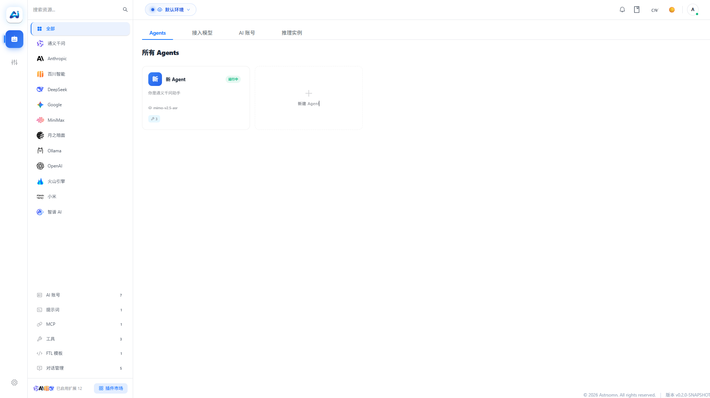

# 🌟 Astrsomn

<p align="center">
  
</p>

<p align="center">
  <a href="README-EN.md"></a>
  <a href="README.md"></a>
  <a href="https://www.apache.org/licenses/LICENSE-2.0"></a>
  <a href="https://github.com/langchain4j/langchain4j"></a>
  <a href="https://maven.apache.org/"></a>
  <a href="https://spring.io/projects/spring-boot"></a>
  <a href="https://github.com/Astrsomn/Astrsomn/issues"></a>
  <a href="https://github.com/Astrsomn/Astrsomn/stargazers"></a>
  <a href="https://github.com/Astrsomn/Astrsomn/network/members"></a>
</p>

---

## ⚡ 30-Second Quick Overview

- **What it is**: A Java AI starter built on LangChain4j
- **What you get**: One `@Astro` annotation to invoke AI models, with pluggable multi-Provider switching
- **The problem it solves**: Converges complex LangChain4j configurations into a standardized setup with visual management
- **How to start**: Download the deployment package and run, or add it as a Maven dependency to your project

> [!WARNING]
> ## Work in Progress — Not Production Ready
> This project is **incomplete** and under active development. Features, configuration, and APIs may change at any time.
> **Do not use in production**. It is intended for learning, evaluation, and feedback.

---

## 📖 Project Overview

**Astrsomn** is a Java AI integration framework built on LangChain4j. Add one Starter dependency to access multi-model capabilities, and manage everything through a built-in web console.

<p align="center">
  
  <br/>
  <em>Admin Console — centrally manage models, agents, and vector stores through a visual interface (Chinese screenshot placeholder, to be replaced with English version)</em>
</p>

Core design philosophy: **make the complex simple**. LangChain4j is powerful, but its engineering configuration is scattered — model access, Provider selection, runtime parameters, and vector store integration all require separate setup. Astrsomn unifies them into standardized configuration with a web console for at-a-glance management.

| Layer | Responsibility |
| ---- | ---- |
| **core** | Unified abstraction & common utilities |
| **starter** | Spring Boot auto-configuration & access layer |
| **providers** | Model provider implementations (14 supported) |
| **vector** | Vector store implementation (Qdrant verified) |
| **server** | Service-oriented runtime & governance |
| **ui** | Visual configuration & operations console |

---

## ✨ Core Features

| Feature | Description |
| --- | --- |
| 🔧 **Deep Integration** | Full LangChain4j encapsulation (LLM / Embedding / Vector DB / Memory / RAG / Tools / Agent) |
| 🚀 **Zero-Invasion Setup** | Spring Boot Starter auto-configuration, integrate with one `@Astro` annotation |
| 🔌 **Pluggable Architecture** | Provider/Vector pluggable design, switch between 14 model providers flexibly |
| 📡 **Streaming Response** | Streaming output, tool calling, memory, RAG, and orchestration support |
| 📊 **Observability** | Production-ready observability (config management, operation logs, cost tracking) |
| 🔒 **Enterprise Features** | Multi-model, multi-tenant, rate limiting, monitoring, and logging governance |
| 🛡️ **High Availability** | Built-in circuit breaker, fallback, and failover (CompositeChatModel multi-route) |
| 🔗 **Native Compatibility** | Fully compatible with native LangChain4j, seamless extension to Agent / RAG / Tools |

---

### 💬 Chat Interface Preview

Astrsomn provides a commercial-grade chat interface with multi-turn conversation, streaming output, session management, and full context memory.

<p align="center">
  
  <br/>
  <em>AI Chat Interface — multi-turn conversation, streaming output, and context memory (Chinese screenshot placeholder, to be replaced with English version)</em>
</p>

---

## 🏗️ Project Status

| Status | Module | Description |
| ---- | -------- | ---- |
| ✅ | **Agent Lifecycle** | Create, configure, and manage agents |
| ✅ | **Environment Init** | Quick environment setup & initialization |
| ✅ | **Dependency Import** | One-click Maven Starter integration |
| ✅ | **Basic Configuration** | Core configuration management |
| ✅ | **RAG Capabilities** | Vector retrieval & knowledge base support |
| 🔄 | **Workflow Module** | Planned for v2.0 |
| ✅ | **Vector Store** | Qdrant verified; Chroma / Milvus in development |
| ❌ | **Security & Governance** | Rate limiting, monitoring pending |
| ⚠️ | **API Compatibility** | May change without notice |

**⚠️ NOT FOR PRODUCTION USE! ⚠️** This project is under active development. Contributions welcome — see [Contributing](#🤝-contributing).

---

## 🛠️ Tech Stack

| Category | Technology |
| ---- | ---- |
| Backend Framework | Spring Boot 3.3.0 |
| Language | Java 17+ |
| AI Integration | LangChain4j 1.11.0 |
| Frontend Framework | Vue 3 + TypeScript |
| Build Tool | Maven |
| Database | MySQL 8.0+ |
| Vector Database | Qdrant |

> LangChain4j community integration version: `1.11.0-beta19`. See each module's `pom.xml` for exact patch versions.

### Key Dependencies

| Dependency | Version | Purpose |
| -------- | ---- | ---- |
| `com.astrsomn:astrsomn-runtime-starter` | `0.2.0-SNAPSHOT` | One-stop access entry, annotation injection & runtime |
| `dev.langchain4j:langchain4j-core` | `1.11.0` | LangChain4j core abstraction & invocation |
| `dev.langchain4j:langchain4j-open-ai` | `1.11.0` | OpenAI protocol model access (DeepSeek, etc.) |
| `dev.langchain4j:langchain4j-community-zhipu-ai` | `1.11.0-beta19` | Zhipu AI model access |
| `org.springframework.boot:spring-boot-starter` | `3.3.0` | Spring Boot runtime & auto-configuration |
| `com.baomidou:mybatis-plus-spring-boot3-starter` | `3.5.5` | Data access & configuration persistence |

---

## 🧩 Module Structure

```text
Astrsomn
├── astrsomn-common                      # Common: utilities, base entities, exceptions
├── astrsomn-api                         # API interface definitions
│   ├── astrsomn-api-runtime             # Runtime API (core DTOs, error enums)
│   ├── astrsomn-api-storage             # Storage API
│   ├── astrsomn-api-system              # System management API
│   ├── astrsomn-api-vector              # Vector store API
│   └── astrsomn-api-workflow            # Workflow API (planned)
├── astrsomn-integrations                # Integration layer (Spring Boot Starters)
│   ├── astrsomn-runtime-starter         # Runtime Starter (entry point)
│   │   └── route                        # Model routing module
│   │       ├── CompositeChatModel               # Composite chat model (failover)
│   │       ├── CompositeStreamingChatModel      # Composite streaming model
│   │       ├── EndpointSelectionStrategy        # Load balancing
│   │       └── ResilienceDecorationStrategy     # Circuit breaker & fallback
│   ├── astrsomn-system-starter          # System management Starter
│   ├── astrsomn-vector-starter          # Vector store Starter
│   ├── astrsomn-workflow-starter        # Workflow Starter (planned)
│   └── astrsomn-internal-storage        # Internal storage implementation
├── astrsomn-plugins                     # Plugin ecosystem
│   ├── astrsomn-providers               # 14 model providers (see below)
│   │   ├── astrsomn-provider-deepseek
│   │   ├── astrsomn-provider-zhipu
│   │   ├── astrsomn-provider-openai
│   │   ├── astrsomn-provider-ali
│   │   ├── astrsomn-provider-anthropic
│   │   ├── astrsomn-provider-baichuan
│   │   ├── astrsomn-provider-gemini
│   │   ├── astrsomn-provider-minimax
│   │   ├── astrsomn-provider-moonshot
│   │   ├── astrsomn-provider-ollama
│   │   ├── astrsomn-provider-qianfan
│   │   ├── astrsomn-provider-tencent
│   │   ├── astrsomn-provider-volcengine
│   │   └── astrsomn-provider-xiaomi
│   └── astrsomn-vector                  # Vector stores
│       ├── astrsomn-vector-qdrant       # Qdrant ✅ (verified)
│       ├── astrsomn-vector-chroma       # 🔄 In development
│       ├── astrsomn-vector-milvus       # 🔄 In development
│       └── astrsomn-vector-redis        # ❌ Planned
├── astrsomn-server                      # Server application (HTTP API)
└── astrsomn-ui                          # Frontend console (Vue 3 + TypeScript)
```

### Dependency Flow

```
common → api → integrations → server
                    ↕
              plugins (providers / vector)
```

- `server` depends on: `integrations`, `plugins`
- `integrations` depends on: `api`, `common`
- `plugins` depends on: `api`
- `api` depends on: `common`

Configure each Agent's model, parameters, and prompts through the visual console:

<p align="center">
  
  <br/>
  <em>Agent Configuration — create and manage AI agents in the console (Chinese screenshot placeholder, to be replaced with English version)</em>
</p>

---

## 🚀 Quick Start

Astrsomn provides two paths: **Server Deployment** (ready to use) and **Framework Integration** (Maven dependency for your project).

---

### Path 1: Server Deployment

#### Prerequisites

| Environment | Version |
| ---- | -------- |
| JDK | 17+ |
| MySQL | 8.0+ |
| Node.js | 18+ (frontend development) |
| Maven | 3.8+ (source builds) |

> If using a pre-built release package (GitHub Releases), Maven and Node.js are not required — they are only needed for source builds.

#### 1. Download

Get the platform-specific archive from [GitHub Releases](https://github.com/Astrsomn/Astrsomn/releases):

```
# Windows:  astrsomn-windows.zip
# Linux:    astrsomn-linux.tar.gz
# macOS:    astrsomn-macos.tar.gz
```

Extracted directory structure:

```
astrsomn/
├── astrsomn-server.jar        # Spring Boot fat JAR
├── config/application.yml     # Configuration
├── database/V1__Initial.sql   # Schema migration
└── bin/
    ├── start.sh / start.bat   # Start script
    ├── stop.sh / stop.bat     # Stop script
    └── .env                   # JVM options
```

#### 2. Create & Initialize Database

```sql
CREATE DATABASE astro_ai DEFAULT CHARACTER SET utf8mb4;
```

> Manual import (optional): `mysql -u root -p astro_ai < database/V1__Initial.sql`

#### 3. Configure

Edit `config/application.yml` with your MySQL connection:

```yml
spring:
  profiles:
    active: mysql

astrsomn:
  enabled: true
  datasource:
    url: jdbc:mysql://127.0.0.1:3306/astro_ai?useUnicode=true&characterEncoding=utf8&serverTimezone=Asia/Shanghai&useSSL=false
    username: root
    password: root
    driver-class-name: com.mysql.cj.jdbc.Driver

server:
  port: 4481
```

#### 4. Start

```bash
# Windows
bin\start.bat

# Linux / macOS
chmod +x bin/*.sh
./bin/start.sh
```

> JVM options can be tuned in `bin/.env`. Default: `JAVA_OPTS=-Xms256m -Xmx1024m -Dfile.encoding=UTF-8`

#### 5. Access

Open [http://localhost:4481](http://localhost:4481) in your browser.

Default admin credentials:

| Username | Password |
| -------- | -------- |
| `admin` | `admin` |

> ⚠️ **Change the default password immediately** after first login. Configure HTTPS and API keys for production.

Post-login steps:
- Go to **Console > Model Instances** to configure AI models
- Go to **Console > Agent Management** to create your first agent

---

### Path 2: Framework Integration

Add Astrsomn as a Maven dependency to your Spring Boot project.

#### 1. Add Maven Repository

Astrsomn is published on Sonatype Central (currently SNAPSHOT):

```xml
<repositories>
    <repository>
        <id>maven-central-snapshots</id>
        <url>https://central.sonatype.com/repository/maven-snapshots/</url>
        <snapshots>
            <enabled>true</enabled>
            <updatePolicy>always</updatePolicy>
        </snapshots>
    </repository>
    <repository>
        <id>central</id>
        <url>https://repo.maven.apache.org/maven2</url>
        <snapshots>
            <enabled>false</enabled>
        </snapshots>
    </repository>
</repositories>
```

#### 2. Add Runtime Starter

```xml
<dependency>
    <groupId>com.astrsomn</groupId>
    <artifactId>astrsomn-runtime-starter</artifactId>
    <version>0.2.0-SNAPSHOT</version>
</dependency>
```

The Starter auto-manages: AI model routing & wiring, multi-turn conversation memory, database & MyBatis-Plus configuration, plugin hot-loading.

#### 3. Choose a Model Provider

Pick at least one provider (14 supported):

```xml
<!-- DeepSeek (recommended) -->
<dependency>
    <groupId>com.astrsomn</groupId>
    <artifactId>astrsomn-provider-deepseek</artifactId>
    <version>0.2.0-SNAPSHOT</version>
</dependency>

<!-- Or Zhipu -->
<dependency>
    <groupId>com.astrsomn</groupId>
    <artifactId>astrsomn-provider-zhipu</artifactId>
    <version>0.2.0-SNAPSHOT</version>
</dependency>

<!-- Or OpenAI -->
<dependency>
    <groupId>com.astrsomn</groupId>
    <artifactId>astrsomn-provider-openai</artifactId>
    <version>0.2.0-SNAPSHOT</version>
</dependency>
```

See [Extension Ecosystem](#-extension-ecosystem) for the full list.

#### 4. Configure Data Sources

The Starter uses a **dual-datasource** architecture — your business database and the AI runtime database are fully isolated:

```yml
# Your business datasource
spring:
  datasource:
    url: jdbc:mysql://127.0.0.1:3306/astro_store
    username: your_user
    password: your_password

# Astrsomn runtime datasource
astrsomn:
  enabled: true
  env-code: PRO
  datasource:
    url: jdbc:mysql://127.0.0.1:3306/astro_ai
    username: astro_ai_user
    password: astro_ai_pass
    driver-class-name: com.mysql.cj.jdbc.Driver
```

> The Starter uses `@AutoConfigureAfter(DataSourceAutoConfiguration.class)` to ensure your business datasource is registered first — no need to worry about `@Primary`.

#### 5. Enable Astrsomn Runtime

Add `@EnableAstroRuntime` to your `@SpringBootApplication` class:

```java
@SpringBootApplication
@EnableAstroRuntime                // enable all subsystems
// @EnableAstroRuntime(vector = false)  // disable vector store
// @EnableAstroRuntime(workflow = false) // disable workflow
public class MyApplication {
    public static void main(String[] args) {
        SpringApplication.run(MyApplication.class, args);
    }
}
```

#### 6. Use `@Astro` for Injection

No manual wiring needed — annotate a field with `@Astro` and call AI directly:

```java
import com.astrsomn.starter.runtime.langchain.aop.annotation.Astro;
import com.astrsomn.api.runtime.common.langchain.AstroChatAssistant;

@Service
public class MyService {

    @Astro(agentKey = "AG-AMVM5U0U")
    private AstroChatAssistant assistant;

    public String chat(String message) {
        return assistant.chat(message);
    }
}
```

> The `agentKey` corresponds to an Agent created in the admin console. Go to **Console > Agent Management** to create and manage agents.

---

## 📚 Official Website & Documentation

| Type | Link |
| ---- | ---- |
| 🏠 Website | [astrsomn.com](https://www.astrsomn.com/home.html) |
| 📖 Documentation | [doc.astrsomn.com](https://doc.astrsomn.com) |
| 💻 GitHub | [Astrsomn/Astrsomn](https://github.com/Astrsomn/Astrsomn) |

### Additional Resources

| Document | Link |
| -------- | ---- |
| 📖 System Design | [System Design](document/系统设计文档.md) |
| 🌐 Introduction Site | [astrsomn-introduction](astrsomn-introduction/) |
| 📝 Chinese README | [README.md](README.md) |
| 📋 Version Roadmap | [Roadmap 1.x to 2.x](document/2026-04-17/版本路线规划-1x到2x.md) |
| 🗂️ Workflow Design | [AI Workflow Standardization Roadmap](document/2026-04-26/ai-workflow-standardization-roadmap.md) |
| 📐 Vector Storage Spec | [Vector Storage Extension Spec](document/2026-04-06/向量存储扩展设计规范.md) |
| 📊 Extension Architecture | [Extension Architecture Analysis](document/2026-04-15/扩展系统架构分析.md) |

---

## 📦 Extension Ecosystem

### Model Providers (14)

| Provider | Module | Status |
| -------- | ------ | ------ |
| DeepSeek | `astrsomn-provider-deepseek` | ✅ Verified |
| Zhipu | `astrsomn-provider-zhipu` | ✅ Verified |
| OpenAI | `astrsomn-provider-openai` | ✅ Available |
| Qwen (Alibaba) | `astrsomn-provider-ali` | ✅ Available |
| Anthropic | `astrsomn-provider-anthropic` | ✅ Available |
| Baichuan | `astrsomn-provider-baichuan` | ✅ Available |
| Gemini | `astrsomn-provider-gemini` | ✅ Available |
| MiniMax | `astrsomn-provider-minimax` | ✅ Available |
| Moonshot | `astrsomn-provider-moonshot` | ✅ Available |
| Ollama | `astrsomn-provider-ollama` | ✅ Available |
| Qianfan (Baidu) | `astrsomn-provider-qianfan` | ✅ Available |
| Tencent Hunyuan | `astrsomn-provider-tencent` | ✅ Available |
| Volcengine | `astrsomn-provider-volcengine` | ✅ Available |
| Xiaomi | `astrsomn-provider-xiaomi` | ✅ Available |

### Vector Stores

| Store | Module | Status |
| ----- | ------ | ------ |
| Qdrant | `astrsomn-vector-qdrant` | ✅ Verified |
| Chroma | `astrsomn-vector-chroma` | 🔄 In development |
| Milvus | `astrsomn-vector-milvus` | 🔄 In development |
| Redis | `astrsomn-vector-redis` | ❌ Planned |

---

## 🤝 Contributing

We appreciate all forms of contribution!

### Ways to Contribute

- 💡 [Submit Issues](https://github.com/Astrsomn/Astrsomn/issues) — Report bugs or suggest features
- 📝 [Submit Pull Requests](https://github.com/Astrsomn/Astrsomn/pulls) — Contribute code
- 📖 Improve documentation
- 🗣️ Share experiences in Discussions

### Process

1. **Fork** → [Astrsomn/Astrsomn](https://github.com/Astrsomn/Astrsomn)
2. **Branch** (`git checkout -b feature/your-feature`)
3. **Commit** (`git commit -m 'Add some feature'`)
4. **Push** (`git push origin feature/your-feature`)
5. **PR** → [Submit](https://github.com/Astrsomn/Astrsomn/pulls)

### Guidelines

- Follow the [Code Style Guide](document/2026-04-02/开源完善总方案.md)
- Ensure all tests pass before submitting
- Provide clear commit messages and PR descriptions

---

## 💬 Community

<p align="center">
  <a href="https://github.com/Astrsomn/Astrsomn/discussions"></a>
  <a href="https://github.com/Astrsomn/Astrsomn/issues"></a>
  <a href="https://github.com/Astrsomn/Astrsomn/pulls"></a>
  <a href="mailto:astrsomn@outlook.com"></a>
</p>

- 💬 **Discussions**: [GitHub Discussions](https://github.com/Astrsomn/Astrsomn/discussions)
- 🐛 **Issues**: [GitHub Issues](https://github.com/Astrsomn/Astrsomn/issues)
- 🔧 **PRs**: [Pull Requests](https://github.com/Astrsomn/Astrsomn/pulls)
- 📧 **Email**: <astrsomn@outlook.com>

---

<p align="center">
  Made with ❤️ by the Astrsomn Team
</p>

<p align="center">
  <a href="https://www.astrsomn.com/home.html"></a>
  <a href="https://doc.astrsomn.com"></a>
  <a href="https://github.com/Astrsomn/Astrsomn"></a>
  <a href="https://gitter.im/Astrsomn/community"></a>
</p>
