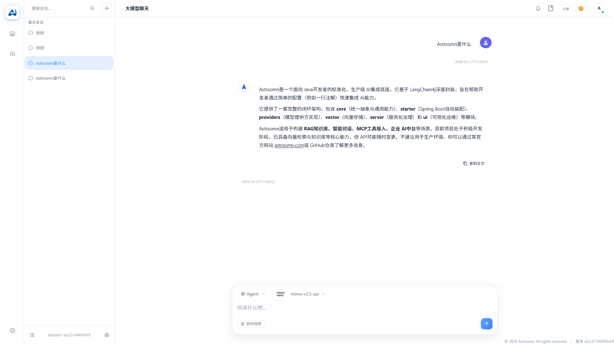
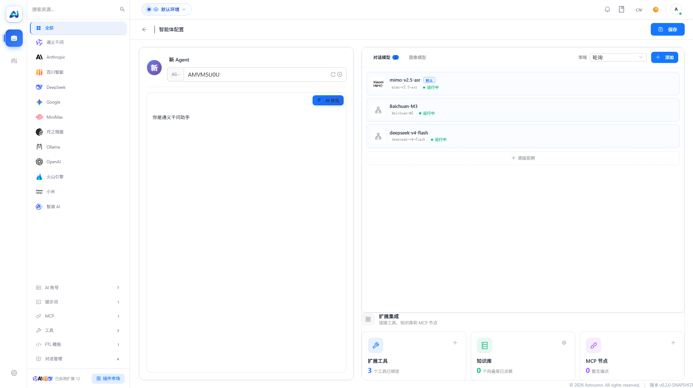

# 🌟 Astrsomn

<p align="center">
  
</p>

<p align="center">
  <a href="README-EN.md"></a>
  <a href="README.md"></a>
  <a href="https://www.apache.org/licenses/LICENSE-2.0"></a>
  <a href="https://github.com/langchain4j/langchain4j"></a>
  <a href="https://maven.apache.org/"></a>
  <a href="https://spring.io/projects/spring-boot"></a>
  <a href="https://github.com/Astrsomn/Astrsomn/issues"></a>
  <a href="https://github.com/Astrsomn/Astrsomn/stargazers"></a>
  <a href="https://github.com/Astrsomn/Astrsomn/network/members"></a>
</p>

---

## ⚡ 30 秒快速了解

- **这是什么**：一个基于 LangChain4j 封装的 Java AI Starter
- **你能得到什么**：一行注解 `@Astro` 快速发起模型调用，支持多 Provider 可插拔切换
- **它解决什么问题**：把 LangChain4j 的复杂配置收敛为标准化配置，并提供可视化管理能力
- **怎么开始**：下载部署包启动服务，或作为 Maven 依赖引入你的项目

> [!WARNING]
> ## 当前为半成品（开发中）
> 这个项目目前**尚未完成**，仍在快速迭代阶段，功能、配置和 API 都可能发生变化。
> **请勿用于生产环境**，仅建议用于学习、体验与反馈。

---

## 📖 项目介绍

**Astrsomn** 是一个基于 LangChain4j 封装的 Java AI 集成框架。你只需引入一个 Starter 依赖，就能快速接入多模型能力；同时提供开箱即用的 Web 控制台，通过可视化界面完成全部运维操作。

<p align="center">
  
  <br/>
  <em>管理控制台概览 — 通过可视化界面完成模型、Agent、向量库的集中管理</em>
</p>

核心设计理念：**把复杂收敛为简单**。LangChain4j 的能力很强大，但工程配置分散——模型接入、Provider 选择、运行参数、向量库集成都需要各自配置。Astrsomn 将它们统一抽象为标准化配置，并提供 Web 控制台让管理者一目了然。

| 分层 | 职责 |
| ---- | ---- |
| **core** | 统一抽象与通用能力 |
| **starter** | Spring Boot 自动装配与接入层 |
| **providers** | 模型提供方能力实现（已适配 14 家） |
| **vector** | 向量存储能力实现（Qdrant 已验证） |
| **server** | 服务化运行与治理 |
| **ui** | 可视化配置与运维控制台 |

---

## ✨ 核心特性

| 特性 | 描述 |
| --- | --- |
| 🔧 **深度封装** | 完整封装 LangChain4j 能力（LLM / Embedding / Vector Database / Memory / RAG / Tools / Agent） |
| 🚀 **零侵入接入** | Spring Boot Starter 自动配置，一行 `@Astro` 注解即可集成 |
| 🔌 **可插拔设计** | Provider/Vector 可插拔架构，支持 14 家模型提供方灵活切换 |
| 📡 **流式响应** | 支持流式响应、工具调用、记忆、RAG、编排等完整链路 |
| 📊 **可观测能力** | 面向生产的可观测与可维护能力（配置管理、操作日志、成本追踪） |
| 🔒 **企业级特性** | 支持多模型、多租户、限流、监控、日志等企业级治理能力 |
| 🛡️ **高可用保障** | 内置熔断、降级、故障转移机制（CompositeChatModel 多路路由） |
| 🔗 **原生兼容** | 完全兼容原生 LangChain4j，可无缝扩展至 Agent / RAG / Tools |

---

### 💬 对话能力预览

Astrsomn 提供了对标商业产品的对话交互界面，支持多轮对话、流式输出、会话管理，以及完整的上下文记忆能力。

<p align="center">
  
  <br/>
  <em>AI 对话交互界面 — 支持多轮对话、流式输出与上下文记忆</em>
</p>

---

## 🏗️ 项目状态

| 状态 | 功能模块 | 说明 |
| ---- | -------- | ---- |
| ✅ | **Agent 生命周期** | 已完成创建、配置、管理能力 |
| ✅ | **环境初始化** | 支持快速环境配置与初始化 |
| ✅ | **依赖快速引入** | Maven Starter 一键集成 |
| ✅ | **基本配置功能** | 提供核心配置管理能力 |
| ✅ | **RAG 能力** | 已完成向量检索与知识库能力 |
| 🔄 | **工作流模块** | 计划 2.0 版本发布 |
| ✅ | **向量库集成** | Qdrant 已验证可用；Chroma / Milvus 开发中 |
| ❌ | **安全与治理** | 限流、监控等功能待完善 |
| ⚠️ | **API 兼容性** | 可能随时变更，不保证向后兼容 |

**⚠️ 请勿用于生产环境！⚠️** 本项目正在积极开发中，欢迎一起参与完善，详见 [贡献指南](#🤝-贡献指南)。

---

## 🛠️ 技术栈

| 类别 | 技术 |
| ---- | ---- |
| 后端框架 | Spring Boot 3.3.0 |
| 语言 | Java 17+ |
| AI 集成 | LangChain4j 1.11.0 |
| 前端框架 | Vue 3 + TypeScript |
| 构建工具 | Maven |
| 数据库 | MySQL 8.0+ |
| 向量数据库 | Qdrant |

> LangChain4j 社区集成包版本为 `1.11.0-beta19`，详见各模块 `pom.xml`。

### 关键依赖

| 依赖坐标 | 版本 | 用途 |
| -------- | ---- | ---- |
| `com.astrsomn:astrsomn-runtime-starter` | `0.2.0-SNAPSHOT` | 一站式接入入口，提供注解注入与运行时能力 |
| `dev.langchain4j:langchain4j-core` | `1.11.0` | LangChain4j 核心抽象与调用能力 |
| `dev.langchain4j:langchain4j-open-ai` | `1.11.0` | OpenAI 协议模型接入（DeepSeek 等兼容场景） |
| `dev.langchain4j:langchain4j-community-zhipu-ai` | `1.11.0-beta19` | 智谱模型接入能力 |
| `org.springframework.boot:spring-boot-starter` | `3.3.0` | Spring Boot 运行与自动配置基础 |
| `com.baomidou:mybatis-plus-spring-boot3-starter` | `3.5.5` | 数据访问与配置持久化基础能力 |

---

## 🧩 模块结构

```text
Astrsomn
├── astrsomn-common                      # 通用基础模块（工具类、基础实体、异常定义）
├── astrsomn-api                         # API 接口定义层
│   ├── astrsomn-api-runtime             # 运行时 API（核心 DTO、异常枚举、错误码）
│   ├── astrsomn-api-storage             # 存储 API（文件处理等）
│   ├── astrsomn-api-system              # 系统管理 API
│   ├── astrsomn-api-vector              # 向量存储 API
│   └── astrsomn-api-workflow            # 工作流 API（规划中）
├── astrsomn-integrations                # 集成层（Spring Boot Starter）
│   ├── astrsomn-runtime-starter         # 运行时 Starter（核心入口）
│   │   └── route                        # 模型路由模块
│   │       ├── CompositeChatModel               # 组合聊天模型（故障转移）
│   │       ├── CompositeStreamingChatModel      # 组合流式模型
│   │       ├── EndpointSelectionStrategy        # 端点选择策略（负载均衡）
│   │       └── ResilienceDecorationStrategy     # 弹性装饰策略（熔断、降级）
│   ├── astrsomn-system-starter          # 系统管理 Starter
│   ├── astrsomn-vector-starter          # 向量存储 Starter
│   ├── astrsomn-workflow-starter        # 工作流 Starter（规划中）
│   └── astrsomn-internal-storage        # 内部存储实现
├── astrsomn-plugins                     # 插件生态
│   ├── astrsomn-providers               # 模型提供方（14 个，见下）
│   │   ├── astrsomn-provider-deepseek
│   │   ├── astrsomn-provider-zhipu
│   │   ├── astrsomn-provider-openai
│   │   ├── astrsomn-provider-ali
│   │   ├── astrsomn-provider-anthropic
│   │   ├── astrsomn-provider-baichuan
│   │   ├── astrsomn-provider-gemini
│   │   ├── astrsomn-provider-minimax
│   │   ├── astrsomn-provider-moonshot
│   │   ├── astrsomn-provider-ollama
│   │   ├── astrsomn-provider-qianfan
│   │   ├── astrsomn-provider-tencent
│   │   └── astrsomn-provider-volcengine
│   │   └── astrsomn-provider-xiaomi
│   └── astrsomn-vector                  # 向量存储
│       ├── astrsomn-vector-qdrant       # Qdrant ✅（已验证可用）
│       ├── astrsomn-vector-chroma       # 🔄 开发中
│       ├── astrsomn-vector-milvus       # 🔄 开发中
│       └── astrsomn-vector-redis        # ❌ 待开发
├── astrsomn-server                      # 服务端应用（HTTP 接口、服务化运行）
└── astrsomn-ui                          # 前端控制台（Vue 3 + TypeScript）
```

### 依赖分层

```
common → api → integrations → server
                    ↕
              plugins (providers / vector)
```

- `server` 依赖：`integrations`、`plugins`
- `integrations` 依赖：`api`、`common`
- `plugins` 依赖：`api`
- `api` 依赖：`common`

在控制台中，你可以为每个 Agent 灵活配置模型、参数和提示词，实现可视化的 Agent 管理：

<p align="center">
  
  <br/>
  <em>Agent 配置管理界面 — 在控制台中创建和管理你的 AI Agent</em>
</p>

---

## 🚀 快速开始

Astrsomn 提供两套启动路径：**服务端部署**（开箱即用）和 **框架引入**（作为 Maven 依赖接入你的项目）。

---

### 路径一：服务端部署

#### 环境要求

| 环境 | 版本要求 |
| ---- | -------- |
| JDK | 17+ |
| MySQL | 8.0+ |
| Node.js | 18+（前端开发需要） |
| Maven | 3.8+（源码构建需要） |

> 如果使用预编译安装包（GitHub Releases），无需安装 Maven 和 Node.js，仅源码构建需要。

#### 1. 下载安装包

从 [GitHub Releases](https://github.com/Astrsomn/Astrsomn/releases) 下载对应平台的打包产物：

```
# Windows：  astrsomn-windows.zip
# Linux：    astrsomn-linux.tar.gz
# macOS：    astrsomn-macos.tar.gz
```

解压后目录结构：

```
astrsomn/
├── astrsomn-server.jar        # Spring Boot 主程序
├── config/application.yml     # 配置文件
├── database/V1__Initial.sql   # 数据库初始化脚本
└── bin/
    ├── start.sh / start.bat   # 启动脚本
    ├── stop.sh / stop.bat     # 停止脚本
    └── .env                   # JVM 参数
```

#### 2. 创建并初始化数据库

```sql
CREATE DATABASE astro_ai DEFAULT CHARACTER SET utf8mb4;
```

> 如需手动导入 SQL：`mysql -u root -p astro_ai < database/V1__Initial.sql`

#### 3. 修改配置

编辑 `config/application.yml`，填入你的 MySQL 连接信息：

```yml
spring:
  profiles:
    active: mysql

astrsomn:
  enabled: true
  datasource:
    url: jdbc:mysql://127.0.0.1:3306/astro_ai?useUnicode=true&characterEncoding=utf8&serverTimezone=Asia/Shanghai&useSSL=false
    username: root
    password: root
    driver-class-name: com.mysql.cj.jdbc.Driver

server:
  port: 4481
```

#### 4. 启动服务

```bash
# Windows
bin\start.bat

# Linux / macOS
chmod +x bin/*.sh
./bin/start.sh
```

> JVM 参数通过 `bin/.env` 文件调整，默认 `JAVA_OPTS=-Xms256m -Xmx1024m -Dfile.encoding=UTF-8`

#### 5. 访问系统

打开浏览器访问 [http://localhost:4481](http://localhost:4481)。

默认管理员账号：

| 用户名 | 密码 |
| ------ | ---- |
| `admin` | `admin` |

> ⚠️ 首次登录后请**立即修改默认密码**。生产环境建议配置 HTTPS 和 API 密钥。

登录后：
- 前往「控制台 > 模型实例」配置 AI 模型
- 前往「控制台 > Agent 管理」创建你的第一个 Agent

---

### 路径二：框架引入

将 Astrsomn 作为 Maven 依赖接入你的 Spring Boot 项目。

#### 1. 添加 Maven 仓库

Astrsomn 发布在 Sonatype Central，当前为 Snapshot 版本：

```xml
<repositories>
    <repository>
        <id>maven-central-snapshots</id>
        <url>https://central.sonatype.com/repository/maven-snapshots/</url>
        <snapshots>
            <enabled>true</enabled>
            <updatePolicy>always</updatePolicy>
        </snapshots>
    </repository>
    <repository>
        <id>central</id>
        <url>https://repo.maven.apache.org/maven2</url>
        <snapshots>
            <enabled>false</enabled>
        </snapshots>
    </repository>
</repositories>
```

#### 2. 引入 Runtime Starter

```xml
<dependency>
    <groupId>com.astrsomn</groupId>
    <artifactId>astrsomn-runtime-starter</artifactId>
    <version>0.2.0-SNAPSHOT</version>
</dependency>
```

Starter 会自动管理：AI 模型路由与自动装配、多轮对话记忆、数据库与 MyBatis-Plus 配置、插件热加载机制。

#### 3. 引入模型 Provider

选择至少一个模型提供方（当前已适配 14 家）：

```xml
<!-- DeepSeek（推荐） -->
<dependency>
    <groupId>com.astrsomn</groupId>
    <artifactId>astrsomn-provider-deepseek</artifactId>
    <version>0.2.0-SNAPSHOT</version>
</dependency>

<!-- 或 Zhipu -->
<dependency>
    <groupId>com.astrsomn</groupId>
    <artifactId>astrsomn-provider-zhipu</artifactId>
    <version>0.2.0-SNAPSHOT</version>
</dependency>

<!-- 或 OpenAI -->
<dependency>
    <groupId>com.astrsomn</groupId>
    <artifactId>astrsomn-provider-openai</artifactId>
    <version>0.2.0-SNAPSHOT</version>
</dependency>
```

完整支持列表见 [扩展生态](#-扩展生态)。

#### 4. 配置数据源

Starter 采用**双数据源**架构，你的业务数据库与 AI 运行时数据库完全隔离：

```yml
# 你的业务数据源
spring:
  datasource:
    url: jdbc:mysql://127.0.0.1:3306/astro_store
    username: your_user
    password: your_password

# Astrsomn 运行时数据源
astrsomn:
  enabled: true
  env-code: PRO
  datasource:
    url: jdbc:mysql://127.0.0.1:3306/astro_ai
    username: astro_ai_user
    password: astro_ai_pass
    driver-class-name: com.mysql.cj.jdbc.Driver
```

> Starter 通过 `@AutoConfigureAfter(DataSourceAutoConfiguration.class)` 保证你的业务数据源优先注册，无需操心 `@Primary` 配置。

#### 5. 启用 Astrsomn 运行时

在 `@SpringBootApplication` 类上添加 `@EnableAstroRuntime` 注解：

```java
@SpringBootApplication
@EnableAstroRuntime                // 启用全部子系统
// @EnableAstroRuntime(vector = false)  // 关闭向量库
// @EnableAstroRuntime(workflow = false) // 关闭工作流
public class MyApplication {
    public static void main(String[] args) {
        SpringApplication.run(MyApplication.class, args);
    }
}
```

#### 6. 使用 `@Astro` 注入调用

无需手动实例化，在字段上添加 `@Astro` 注解即可直接调用 AI 对话：

```java
import com.astrsomn.starter.runtime.langchain.aop.annotation.Astro;
import com.astrsomn.api.runtime.common.langchain.AstroChatAssistant;

@Service
public class MyService {

    @Astro(agentKey = "AG-AMVM5U0U")
    private AstroChatAssistant assistant;

    public String chat(String message) {
        return assistant.chat(message);
    }
}
```

> `agentKey` 对应管理后台中创建的 Agent 标识，可在「控制台 > Agent 管理」中创建和查看。

---

## 📚 官方网站与文档

| 类型 | 链接 |
| ---- | ---- |
| 🏠 官方网站 | [astrsomn.com](https://www.astrsomn.com/home.html) |
| 📖 官方文档 | [doc.astrsomn.com](https://doc.astrsomn.com) |
| 💻 GitHub 仓库 | [Astrsomn/Astrsomn](https://github.com/Astrsomn/Astrsomn) |

### 更多资源

| 文档类型 | 链接 |
| -------- | ---- |
| 📖 系统设计文档 | [系统设计文档](document/系统设计文档.md) |
| 🌐 中文介绍站点 | [astrsomn-introduction](astrsomn-introduction/) |
| 📝 英文文档 | [README-EN.md](README-EN.md) |
| 📋 版本路线规划 | [版本路线规划-1x到2x](document/2026-04-17/版本路线规划-1x到2x.md) |
| 🗂️ 工作流设计 | [AI工作流标准化路线图](document/2026-04-26/ai-workflow-standardization-roadmap.md) |
| 📐 向量存储设计 | [向量存储扩展设计规范](document/2026-04-06/向量存储扩展设计规范.md) |
| 📊 扩展系统架构 | [扩展系统架构分析](document/2026-04-15/扩展系统架构分析.md) |

---

## 📦 扩展生态

### 模型提供方（14 个）

| Provider | 模块 | 状态 |
| -------- | ---- | ---- |
| DeepSeek | `astrsomn-provider-deepseek` | ✅ 已验证 |
| Zhipu（智谱） | `astrsomn-provider-zhipu` | ✅ 已验证 |
| OpenAI | `astrsomn-provider-openai` | ✅ 可用 |
| 通义千问（阿里） | `astrsomn-provider-ali` | ✅ 可用 |
| Anthropic | `astrsomn-provider-anthropic` | ✅ 可用 |
| 百川 | `astrsomn-provider-baichuan` | ✅ 可用 |
| Gemini | `astrsomn-provider-gemini` | ✅ 可用 |
| MiniMax | `astrsomn-provider-minimax` | ✅ 可用 |
| Moonshot（月之暗面） | `astrsomn-provider-moonshot` | ✅ 可用 |
| Ollama | `astrsomn-provider-ollama` | ✅ 可用 |
| 千帆（百度） | `astrsomn-provider-qianfan` | ✅ 可用 |
| 腾讯混元 | `astrsomn-provider-tencent` | ✅ 可用 |
| 火山引擎 | `astrsomn-provider-volcengine` | ✅ 可用 |
| 小米 | `astrsomn-provider-xiaomi` | ✅ 可用 |

### 向量存储

| 存储 | 模块 | 状态 |
| ---- | ---- | ---- |
| Qdrant | `astrsomn-vector-qdrant` | ✅ 已验证可用 |
| Chroma | `astrsomn-vector-chroma` | 🔄 开发中 |
| Milvus | `astrsomn-vector-milvus` | 🔄 开发中 |
| Redis | `astrsomn-vector-redis` | ❌ 待开发 |

---

## 🤝 贡献指南

欢迎贡献代码！我们非常感谢任何形式的贡献。

### 贡献方式

- 💡 [提交 Issue](https://github.com/Astrsomn/Astrsomn/issues) — 报告 bug 或提出功能建议
- 📝 [提交 Pull Request](https://github.com/Astrsomn/Astrsomn/pulls) — 贡献代码
- 📖 完善文档 — 帮助改进项目文档
- 🗣️ 社区交流 — 在讨论区分享使用经验

### 贡献流程

1. **Fork 本仓库** → [Astrsomn/Astrsomn](https://github.com/Astrsomn/Astrsomn)
2. **创建功能分支** (`git checkout -b feature/your-feature`)
3. **提交更改** (`git commit -m 'Add some feature'`)
4. **推送到分支** (`git push origin feature/your-feature`)
5. **创建 Pull Request** → [提交 PR](https://github.com/Astrsomn/Astrsomn/pulls)

### 贡献规范

- 请遵循 [代码风格指南](document/2026-04-02/开源完善总方案.md)
- 提交前请确保通过所有测试
- 提供清晰的 commit 信息和 PR 描述

---

## 💬 社区与交流

<p align="center">
  <a href="https://github.com/Astrsomn/Astrsomn/discussions"></a>
  <a href="https://github.com/Astrsomn/Astrsomn/issues"></a>
  <a href="https://github.com/Astrsomn/Astrsomn/pulls"></a>
  <a href="mailto:astrsomn@outlook.com"></a>
</p>

- 💬 **讨论区**：[GitHub Discussions](https://github.com/Astrsomn/Astrsomn/discussions) — 分享使用经验、交流想法
- 🐛 **问题反馈**：[GitHub Issues](https://github.com/Astrsomn/Astrsomn/issues) — 报告 Bug、提出功能建议
- 🔧 **贡献代码**：[Pull Requests](https://github.com/Astrsomn/Astrsomn/pulls) — 欢迎提交 PR
- 📧 **联系邮箱**：<astrsomn@outlook.com>

---

<p align="center">
  Made with ❤️ by the Astrsomn Team
</p>

<p align="center">
  <a href="https://www.astrsomn.com/home.html"></a>
  <a href="https://doc.astrsomn.com"></a>
  <a href="https://github.com/Astrsomn/Astrsomn"></a>
  <a href="https://gitter.im/Astrsomn/community"></a>
</p>
