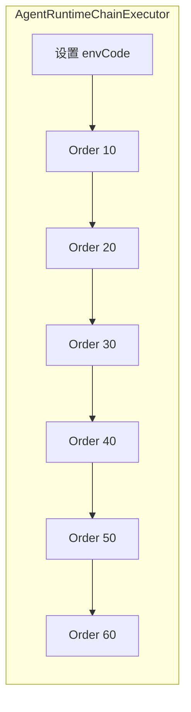

# AstroChatParam 运行时构建链路

本文说明 Spring Boot Starter 中，如何将库表配置合并进 `AstroChatParam`，供 `AstroAssistantFactory` 创建 LangChain4j Assistant 使用。

## 1. 入口

| 入口 | 说明 |
|------|------|
| `AstroAssistantFactory#createAssistant` | 主路径：先 `AgentRuntimeConfigLoader#validateAndApplyAgent`，再走缓存与模型装配。 |
| `@Astro` 字段注入 | `AstroAnnotationProcessor` 解析 `agentKey`（可空则查库默认智能体），构造 `AstroChatParam` 后同样进入 `createAssistant`。 |

配置加载的代码根目录：`astrsomn-spring-boot-starter/.../langchain/runtime/`。

## 2. 责任链总览

`AgentRuntimeChainExecutor` 在每次执行时：

1. 将 `EnvRuntime.resolveEffectiveEnvCode(AstrsomnProperties)` 写入 `AgentRuntimeContext#envCode`（请求头 `EnvScope` 优先，否则 `astrsomn.env-code`）。
2. 按 Spring `@Order` **升序**调用所有 `AgentRuntimeChainHandler`。

## 3. 各环职责（@Order）

| Order | 类 | 作用 |
|------:|-----|------|
| 10 | `ApplyDatabaseDefaultsChainHandler` | `agentKey` 为空时，查当前环境下 `AI_AGENT.IS_DEFAULT = 1` 的记录，写入 `AGENT_KEY`。 |
| 20 | `ValidateChatRequestChainHandler` | 校验 `agentKey` 非空；`memoryKey` 为空则生成 UUID。**不校验 `userMessage`**（见下文）。 |
| 30 | `ResolveAgentChainHandler` | 按 `agentKey + envCode` 加载 `AI_AGENT`，并把 Agent 上的引用合并进 Param（仅补 null/空集合）。 |
| 40 | `ResolveInstanceChainHandler` | 按 `instanceKey` 加载 `AI_INSTANCE`，合并 `ChatSetting`；若 `modelKey` 仍空则用实例的 `MODEL_KEY`，再空则用库默认对话模型。 |
| 50 | `ResolveModelChainHandler` | 按 `modelKey` 加载 `AI_MODEL`，合并 `ModelSetting`（名称、URL、厂商等）。 |
| 60 | `ResolveAccountChainHandler` | 若模型配置了 `ACCOUNT_KEY`，加载 `AI_ACCOUNT`，合并 `apiKey` / `apiSecret`。无账号则跳过。 |

合并字段的具体规则见 `RuntimeChatParamMergeSupport`（统一为：**目标为 null 或字符串空白、集合为空时才写入**），保证**调用方已设置的 Param 优先于库表**。

## 4. 库内「一条默认链路」约定

| 数据 | 条件 | 用途 |
|------|------|------|
| 默认智能体 | `AI_AGENT`：`ENV_CODE` 匹配、`IS_DEFAULT = 1`、未删除；建议每个环境至多一条 | 省略 `agentKey` 时的入口 |
| 默认对话模型 | `AI_MODEL`：`ENV_CODE` 匹配、`IS_DEFAULT = 1`、`MODEL_TYPE = chat`、未删除；建议每个环境至多一条 | 实例未配置 `MODEL_KEY` 时兜底 |

解析逻辑：`AiRuntimeDefaultsResolver`。

## 5. 与业务数据的关系（Agent → Instance → Model → Account）

- **Agent**：`CHAT_INSTANCE_KEY`、`PROMPT_KEY`、工具/MCP/知识库 key 等写入 `AstroChatParam` 对应子对象（不覆盖已有值）。
- **Instance**：采样参数 → `ChatSetting`；可选提供 `MODEL_KEY`。
- **Model**：连接信息 → `ModelSetting`。
- **Account**：凭证 → `ModelSetting` 的密钥字段。

## 6. `userMessage` 为何不在链中校验

- `@Astro` 在 Bean 初始化阶段创建 Assistant 时，通常还没有用户输入。
- Assistant 缓存键不依赖 `userMessage`（见 `AssistantCacheManager#generateConfigHash`）。

因此：**用户消息应在真正发起对话的边界校验**（例如 HTTP Controller、工作流 TASK 节点——`WorkflowAssistantNodeHandlerRegistrar` 已在调用 `chat` 前检查上下文变量）。

## 7. 扩展方式

新增处理环节：实现 `AgentRuntimeChainHandler`，使用 `@Component` + `@Order(数值)` 注册；数值落在现有环节之间或之后即可，`AgentRuntimeChainExecutor` 会自动收集并排序。

## 8. 已移除的历史代码

原 `runtime/strategy` 包（`AbstractEntityHandler` 及各类 `*EntityHandler`）已由上述责任链替代，不再使用。
