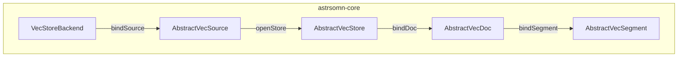

# Astrsomn 向量域抽象层设计

## 1. 文档目的

在 [`VecStoreBackend`](e:/project/Astrsomn/astrsomn-core/src/main/java/org/astrsomn/core/common/langchain/extension/VecStoreBackend.java) 与 [向量存储扩展设计规范](./向量存储扩展设计规范.md) 之上，为 **Source（数据源）→ Store（集合）→ Doc（文档）→ Segment（切片）** 定义 **四层抽象类**，使各 `astrsomn-vector-*` 子模块通过 **继承实现** 对外暴露统一的「连接向量服务 + 分层操作」能力；业务与 Starter 可通过 **`VecStoreBackend#bindSource`** 获得根句柄，再逐级 `openStore` / `bindDoc` / `bindSegment` 访问下层，而无需直接依赖具体厂商类。

**版本**：1.0  

---

## 2. 与领域实体的对应关系

| 抽象类 | 领域实体 | 含义 |
|--------|----------|------|
| `AbstractVecSource` | `AiVecSourceEntity` | 一条向量服务连接（host、port、token、`CONFIG_JSON` 等） |
| `AbstractVecStore` | `AiVecStoreEntity` | 该连接下的一个逻辑集合（collection / index 名、维度、距离度量等） |
| `AbstractVecDoc` | `AiVecDocEntity` | 集合内的一篇业务文档及与向量侧的映射（`DOC_ID_IN_STORE`、同步状态等） |
| `AbstractVecSegment` | `AiVecSegmentEntity` | 文档拆分后的切片及 `VECTOR_ID` |

抽象类 **组合** 领域实体（通过构造器注入），在子类中封装 **厂商原生客户端**、**LangChain4j `EmbeddingStore`**、**HTTP 管理 API** 等，实现「通过抽象类获取连库与操作能力」的目标。

---

## 3. 类图与下探路径



**推荐调用链**：

1. 通过 SPI / Spring 注册表解析 `VecStoreBackend`（按 `AiVecSourceEntity.provider` 与 `getExtensionKey()` 一致）。
2. `VecStoreBackend.bindSource(aiVecSource)` → `AbstractVecSource`。
3. `AbstractVecSource.openStore(aiVecStore)` → `AbstractVecStore`（可在此执行 `createOrUpdatePhysicalCollection`、`openEmbeddingStore`）。
4. `AbstractVecStore.bindDoc(aiVecDoc)` → `AbstractVecDoc`（文档级删除、同步策略等）。
5. `AbstractVecDoc.bindSegment(aiVecSegment)` → `AbstractVecSegment`（按 `VECTOR_ID` 点删等）。

扁平 API（`testConnection`、`createOrUpdateCollection`、`openEmbeddingStore` 等）仍保留在 `VecStoreBackend` 上，便于旧代码与无层级场景；实现上应 **委托** 给上述抽象层（如 Qdrant 已在 `QdrantVecStoreBackend` 中委托给 `QdrantVecSource` / `QdrantVecStore`）。

---

## 4. 核心抽象 API 摘要

包路径：`org.astrsomn.core.common.langchain.vector`

| 类型 | 主要职责 |
|------|----------|
| `AbstractVecSource` | `getExtensionKey()`、`testConnection()`、`openStore(AiVecStoreEntity)` |
| `AbstractVecStore` | `createOrUpdatePhysicalCollection()`、`deletePhysicalCollection()`、`openEmbeddingStore()`、`bindDoc(AiVecDocEntity)` |
| `AbstractVecDoc` | `deleteAllEmbeddingsInStore()`、`bindSegment(AiVecSegmentEntity)` |
| `AbstractVecSegment` | `deleteEmbedding()` |

**说明**：

- `openEmbeddingStore()` 返回 LangChain4j `EmbeddingStore<TextSegment>`，与 RAG、向量化写入共用。
- Doc / Segment 的 **写入、检索参数** 可在后续迭代中在抽象类上增加 `default` 方法或新抽象方法，本版以 **删除与绑定** 为主，与现有表字段对齐。

---

## 5. `VecStoreBackend` 扩展

在原有扁平方法之外增加：

```text
AbstractVecSource bindSource(AiVecSourceEntity source);
```

每个向量子模块的 `VecStoreBackend` 实现必须提供 `bindSource`，返回 **本模块的 `AbstractVecSource` 子类实例**。

---

## 6. Qdrant 实现映射（参考）

| 抽象类 | Qdrant 实现类 |
|--------|----------------|
| `AbstractVecSource` | [`QdrantVecSource`](e:/project/Astrsomn/astrsomn-vector/astrsomn-vector-qdrant/src/main/java/org/astrsomn/vector/qdrant/QdrantVecSource.java) |
| `AbstractVecStore` | [`QdrantVecStore`](e:/project/Astrsomn/astrsomn-vector/astrsomn-vector-qdrant/src/main/java/org/astrsomn/vector/qdrant/QdrantVecStore.java) |
| `AbstractVecDoc` | [`QdrantVecDoc`](e:/project/Astrsomn/astrsomn-vector/astrsomn-vector-qdrant/src/main/java/org/astrsomn/vector/qdrant/QdrantVecDoc.java) |
| `AbstractVecSegment` | [`QdrantVecSegment`](e:/project/Astrsomn/astrsomn-vector/astrsomn-vector-qdrant/src/main/java/org/astrsomn/vector/qdrant/QdrantVecSegment.java) |

- **连接与健康检查**：`QdrantVecSource` 使用 [`QdrantAdminClient`](e:/project/Astrsomn/astrsomn-vector/astrsomn-vector-qdrant/src/main/java/org/astrsomn/vector/qdrant/internal/QdrantAdminClient.java) 访问 REST 根路径。
- **集合生命周期**：`QdrantVecStore` 使用同一客户端创建/删除 collection；`openEmbeddingStore` 使用 LangChain4j `QdrantEmbeddingStore`。
- **文档级删除**：`QdrantVecDoc` 通过 REST `points/delete` + **payload 过滤**；默认 payload 键为 `doc_id`，取值 **`String.valueOf(AiVecDocEntity.getId())`**。入库时 **必须** 在 `TextSegment` metadata 中写入相同键值，否则按文档删除无法命中。
- **切片级删除**：`QdrantVecSegment` 使用 `VECTOR_ID` 作为 Qdrant point id 列表删除。

---

## 7. 其他子模块（Milvus、Redis 等）落地方式

1. 在 `astrsomn-vector-<name>` 中实现 `VecStoreBackend` 与四个抽象子类。
2. `bindSource` 返回 `<Name>VecSource extends AbstractVecSource`。
3. 在 `AbstractVecStore` 子类中集中暴露 **原生 SDK 客户端** 或 **EmbeddingStore**（若需暴露给运维/调试，可增加 `protected` 访问子或受控 getter，避免泄漏到业务层）。
4. Doc / Segment 语义与 Qdrant 可能不同（例如主键类型、过滤 DSL），在各自子类中实现，**保持抽象类方法签名一致**，便于上层统一编排。

---

## 8. 与 Starter / Server 的衔接（后续工作）

- **Starter**：可实现 `VecStoreBackendRegistry`（类比 `AstroModelFactory`），合并 Spring Bean 与 SPI，按 `provider` 解析 `VecStoreBackend`，再 `bindSource`。
- **Server**：`AiVecSourceService` / `AiVecStoreService` 在「测试连接」「创建集合」「删除文档」等操作中注入 Registry，调用抽象层而非直接依赖 `Qdrant*` 类型。

---

## 9. 附录：核心文件路径

| 说明 | 路径 |
|------|------|
| 四层抽象基类 | `astrsomn-core/src/main/java/org/astrsomn/core/common/langchain/vector/` |
| 后端契约 + `bindSource` | `astrsomn-core/.../VecStoreBackend.java` |
| Qdrant 实现包 | `astrsomn-vector/astrsomn-vector-qdrant/src/main/java/org/astrsomn/vector/qdrant/` |

---

*实现以代码为准；若与运行中 Qdrant 版本 REST 契约不一致，以厂商文档与子模块单测为准调整。*
