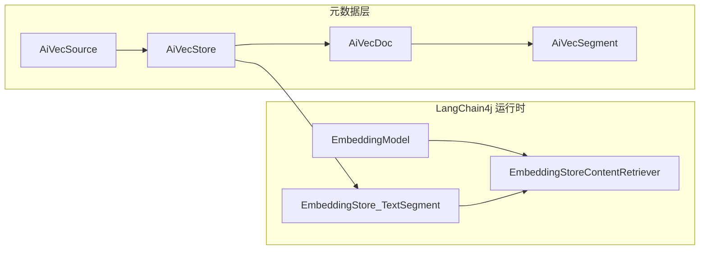

# Astrsomn 向量存储扩展设计规范

本文档定义 Astrsomn 在已具备**模型 Provider** 集成能力的前提下，如何以与 Provider **对称**的方式接入**向量库实现**（Vector Backend）：支持数据源接入、物理集合/索引管理、文档向量化与元数据同步、检索与删除等常规能力。实现侧统一采用 **LangChain4j**（`EmbeddingModel`、`EmbeddingStore`、`TextSegment` 等）作为技术底座；首个试点实现为 **Qdrant**（`astrsomn-vector-qdrant`）。

**文档版本**：1.0  
**关联仓库路径**：`astrsomn-core`、`astrsomn-server`、`astrsomn-spring-boot-starter`、`astrsomn-vector/*`

---

## 1. 背景与目标

### 1.1 现状摘要

- **扩展注册**：`SystemExtensionRegistry` 在启动时合并 Spring 容器中的 `AstroExtensionDescriptor` Bean 与 `ServiceLoader`（SPI）结果，按 `extensionKey` 去重后写入 `SYSTEM_EXTENSION` 表。参考：`astrsomn-server/src/main/java/org/astrsomn/server/plugin/SystemExtensionRegistry.java`。
- **插件 jar 元数据**：`ExtensionJarMetadataReader` 使用独立 `URLClassLoader` 读取 jar 内 SPI，解析 `AstroExtensionDescriptor`，并额外加载 `ModelProviderHandler` 以提取 `providerCode` 填入 `SystemExtensionMetaData`。参考：`astrsomn-server/src/main/java/org/astrsomn/server/plugin/ExtensionJarMetadataReader.java`。
- **扩展类型**：`SystemExtensionEnum.ExtensionTypeEnum` 已包含 `VECTOR_STORE`（与 `MODEL_PROVIDER`、`MCP` 并列）。参考：`astrsomn-core/src/main/java/org/astrsomn/core/common/constant/SystemExtensionEnum.java`。
- **领域实体**：向量相关元数据已用四张表建模（见第 2 节）。
- **RAG 运行时**：`RagComponentAssembler` 组装 `EmbeddingStoreContentRetriever` 时依赖 `VectorStoreRegistry#getStore(AstroChatParam)`，而当前实现恒返回 `null`，导致 RAG 向量链路未闭环。参考：
  - `astrsomn-spring-boot-starter/src/main/java/org/astrsomn/starter/langchain/tool/rag/RagComponentAssembler.java`
  - `astrsomn-spring-boot-starter/src/main/java/org/astrsomn/starter/langchain/tool/rag/VectorStoreRegistry.java`
- **架构分析**：`document/2026-04-02/starter-及扩展架构分析报告.md` 中已指出「RAG 向量注册链路未完全闭环」。

### 1.2 目标

1. 定义与**模型 Provider**对称的**向量库扩展**规范：`AstroExtensionDescriptor`（类型 `VECTOR_STORE`）+ 核心契约接口 + SPI 注册。
2. 明确 **Source（连接）→ Store（集合）→ Doc（文档）→ Segment（切片）** 与 LangChain4j 运行时对象的映射及 id 持久化策略。
3. 约定 **RAG / 知识库** 如何从数据库或配置解析到具体 `EmbeddingStore`，使 `VectorStoreRegistry` 可稳定实现。
4. 首个落地实现以 **Qdrant** 为试点（`astrsomn-vector-qdrant`），并与 starter 中既有 `QdrantVectorHandler` 的长期关系写清楚（下沉或委托，避免双份实现）。

### 1.3 非目标（本文档不强制实现细节）

- 具体 REST API 的字段校验与权限模型（由 `astrsomn-server` 迭代）。
- 各厂商 SDK 的版本锁定与 BOM 对齐的具体 PR（仅给出原则）。

---

## 2. 术语与实体关系（Source / Store / Doc / Segment）

### 2.1 术语表

| 术语 | 对应实体 | 含义 |
|------|----------|------|
| 向量数据源（Source） | `AiVecSourceEntity`（表 `AI_VEC_SOURCE`） | 一条对外部向量服务的连接配置：地址、凭据、`CONFIG_JSON` 扩展等。 |
| 向量集合 / 逻辑库（Store） | `AiVecStoreEntity`（表 `AI_VEC_STORE`） | 隶属于某一 Source 的一个集合（如 Qdrant collection），含 `collectionName`、`dimension`、`distanceMetric`、`modelKey` 等。 |
| 文档（Doc） | `AiVecDocEntity`（表 `AI_VEC_DOC`） | 业务侧一篇文档在某一 Store 下的记录；`DOC_ID_IN_STORE` 存放向量侧文档级 id（若厂商/LC 支持）。 |
| 切片（Segment） | `AiVecSegmentEntity`（表 `AI_VEC_SEGMENT`） | 一篇文档拆分后的文本块；`VECTOR_ID` 与 LangChain4j 写入向量库后生成的 embedding id 对齐；可冗余 `SEGMENT_CONTENT` 供后台预览。 |

实体定义参考：

- `astrsomn-core/src/main/java/org/astrsomn/core/common/entity/AiVecSourceEntity.java`
- `astrsomn-core/src/main/java/org/astrsomn/core/common/entity/AiVecStoreEntity.java`
- `astrsomn-core/src/main/java/org/astrsomn/core/common/entity/AiVecDocEntity.java`
- `astrsomn-core/src/main/java/org/astrsomn/core/common/entity/AiVecSegmentEntity.java`

### 2.2 实体关系与运行时数据流

- **Store → LcStore**：由「Source 连接信息 + Store 集合配置」构造出面向该集合的 `EmbeddingStore<TextSegment>`。
- **EmbModel**：来自既有**模型 Provider**体系中的嵌入模型（`EmbeddingModel`），其输出维度须与 `AiVecStoreEntity.dimension` 一致。
- **Retriever**：RAG 侧使用 `EmbeddingStoreContentRetriever`（见 `RagComponentAssembler` 现有组装方式）。

### 2.3 关键字段约定

- `AiVecSourceEntity.provider`：字符串，**必须与** 向量扩展的 `AstroExtensionDescriptor.getExtensionKey()` **一致**，供运行时路由到具体实现。
- `AiVecSegmentEntity.vectorId`：向量库内唯一标识（LangChain4j 侧常见为 UUID 字符串）；删除、对账、重试均依赖该字段。
- `AiVecStoreEntity.metadataSchema`：可选，描述 payload/元数据字段约定，便于过滤检索与 UI 展示（与具体后端能力相关）。
- `AiVecSourceEntity.configJson`：存放各实现特有参数（TLS、gRPC、多副本、命名空间映射等），避免无限扩张表字段。

---

## 3. 与模型 Provider 的对称架构（Descriptor + Handler + SPI）

### 3.1 模型 Provider 参考（现有实现）

以 DeepSeek 为例：

- **描述符**：`DeepSeekExtensionDescriptor` 继承 `AstroExtensionDescriptor`，`getExtensionKey()` 返回 `"deepseek"`，`getExtensionType()` 为 `MODEL_PROVIDER`。路径：`astrsomn-providers/astrsomn-provider-deepseek/src/main/java/org/astrsomn/deepseek/DeepSeekExtensionDescriptor.java`。
- **能力处理器**：`DeepSeekAiProviderHandler` 继承 `AbstractModelProviderHandler`，实现 `ModelProviderHandler`。路径：`.../DeepSeekAiProviderHandler.java`。
- **SPI 文件**（`src/main/resources/META-INF/services/`）：
  - `org.astrsomn.core.common.langchain.extension.AstroExtensionDescriptor`
  - `org.astrsomn.core.common.langchain.extension.ModelProviderHandler`

### 3.2 向量库扩展（建议形态）

| 维度 | 模型 Provider | 向量库（本规范） |
|------|----------------|------------------|
| Descriptor | `getExtensionType()` = `MODEL_PROVIDER` | `getExtensionType()` = `VECTOR_STORE` |
| Key | 如 `deepseek` | 如 `qdrant`，与 `AiVecSourceEntity.provider` 一致 |
| 能力接口 | `ModelProviderHandler` | **新增核心契约**（见第 4 节）；**勿与** starter 中现有 `VectorStoreHandler` 同名混淆 |

### 3.3 命名建议（避免冲突）

- **Starter 现状**：`astrsomn-spring-boot-starter/.../rag/impl/VectorStoreHandler.java` 已存在，语义为「按 `VectorStoreType` + `RagSetting` 提供 `EmbeddingStore`」。
- **Core 正式契约建议命名**：`EmbeddingStoreProvider` 或 `VecStoreBackendHandler`（任选其一并在全仓库统一）。下文统称 **VecStoreBackend**。

向量实现模块（如 `astrsomn-vector-qdrant`）应提供：

1. 一个 **Descriptor** 类（`VECTOR_STORE`）。
2. 一个 **VecStoreBackend** 实现类。
3. 两条 SPI 文件：与 DeepSeek 相同位置的 `AstroExtensionDescriptor` + **新接口全限定名**。

### 3.4 插件 jar 与 `SystemExtensionMetaData`

当前 `SystemExtensionMetaData` 为 `record`，含 `providerCode`（来自 `ModelProviderHandler`）。路径：`astrsomn-core/src/main/java/org/astrsomn/core/common/dto/extension/SystemExtensionMetaData.java`。

**演进约定**：

- 在 `ExtensionJarMetadataReader` 中增加可选步骤：若存在 VecStoreBackend 的 SPI，则解析出 **vectorImplementationCode**（与 `extensionKey` 或实现类约定字段一致），用于插件市场展示与安装校验。
- 若短期内不改 record 结构，可采用「仅依赖 `extensionKey` + `type=VECTOR_STORE`」的过渡方案，但在文档中保留 **vectorImplementationCode** 字段扩展，避免与 `MODEL_PROVIDER` 的 `providerCode` 语义混用。

---

## 4. 核心 Java 契约（建议接口职责，先规范后编码）

以下接口放在 **`astrsomn-core`** 的 `org.astrsomn.core.common.langchain.extension`（或与 `ModelProviderHandler` 平级包）中定义，由 `astrsomn-vector-*` 实现。

### 4.1 VecStoreBackend 职责拆分

| # | 能力 | 说明 | 参数来源 |
|---|------|------|----------|
| 1 | 路由标识 | 返回与 `AiVecSourceEntity.provider` / `AstroExtensionDescriptor.getExtensionKey()` 一致的 key。 | 实现类常量 |
| 2 | 连接与健康检查 | `testConnection(sourceConfig)` | `AiVecSourceEntity` 或专用 DTO（不落库前可测） |
| 3 | 集合生命周期 | `createOrUpdateCollection(storeConfig)` / `deleteCollection(storeConfig)` | `AiVecStoreEntity` + 关联 Source |
| 4 | 运行时工厂 | `openEmbeddingStore(source, store)` → `EmbeddingStore<TextSegment>` | RAG、入库共用 |
| 5 | 写入（可选粒度） | 基于 LC4j：向 `EmbeddingStore` 添加 `TextSegment` 并返回 **segment → vectorId** 映射 | 业务服务编排 EmbeddingModel |
| 6 | 删除语义 | 按 `vectorId`、按 doc、按 collection；映射到 LC4j `remove` 或底层 API | 与 `AiVecDocEntity` / `AiVecSegmentEntity` 联动 |
| 7 | 检索 | 优先使用 `EmbeddingStore` 的 search；高级过滤用 payload/metadata，约定在 `CONFIG_JSON` / `metadataSchema` | RAG |

**说明**：第 5、6 步若完全由业务层直接使用 `EmbeddingStore` + `EmbeddingModel` 完成，VecStoreBackend 可只保证 **4** 与 **2、3**；但 **2、3** 对「控制台创建集合」不可或缺。

### 4.2 与 LangChain4j 类型的边界

- **必须**：实现类依赖官方 `langchain4j-*` 模块（如 `langchain4j-qdrant`），返回标准 `EmbeddingStore<TextSegment>`。
- **建议**：集合创建（维度、距离度量）使用各实现客户端或 LangChain4j 封装能力；若 LC 未覆盖，则在实现模块内调用底层 REST/gRPC，但 **连接参数**仍从 `AiVecSourceEntity` / `CONFIG_JSON` 读取。

---

## 5. 生命周期与操作矩阵

### 5.1 操作矩阵

| 操作 | 说明 | 元数据表 | 向量侧 |
|------|------|----------|--------|
| 注册扩展 | Descriptor + SPI + 可选 Spring Bean | `SYSTEM_EXTENSION` | 无 |
| 新建数据源 | 录入连接与 `provider` | `AI_VEC_SOURCE` | `testConnection` |
| 创建集合 | 指定 `collectionName`、维度、距离、嵌入模型 key | `AI_VEC_STORE` | `createOrUpdateCollection` |
| 文档入库 / 向量化 | 切分、嵌入、写入 | `AI_VEC_DOC`、`AI_VEC_SEGMENT` | `EmbeddingStore#addAll` 等 |
| 检索（RAG） | 会话中召回 | 解析 Store | `EmbeddingStoreContentRetriever` |
| 删除切片 | 按 `VECTOR_ID` | 删 `AI_VEC_SEGMENT` | `remove(id)` |
| 删除文档 | 删该 doc 下全部 vector | 删 Doc/Segment | 批量 remove 或按 filter |
| 删除集合 | 控制台或运维 | 删 Store 及级联策略由业务定义 | `deleteCollection` |

### 5.2 故障与一致性（原则）

- **双写顺序**：建议先写向量库成功，再更新 DB；或采用「先 DB 标记处理中 → 向量 → 成功落段」可补偿任务。具体事务边界由实现阶段选定。
- **维度不一致**：保存 Store 时校验 `dimension` 与所选 `EmbeddingModel` 输出维度一致，否则拒绝创建集合。
- **扩展卸载**：卸载向量插件前，应限制新建使用该 `provider` 的 Source；已存在连接的处理策略（禁用 / 迁移）由运维文档补充。

---

## 6. 与 LangChain4j 的映射

| Astrsomn 概念 | LangChain4j |
|---------------|-------------|
| 嵌入 | `dev.langchain4j.model.embedding.EmbeddingModel` |
| 向量存储 | `dev.langchain4j.store.embedding.EmbeddingStore<TextSegment>` |
| 文本块 | `dev.langchain4j.data.segment.TextSegment`（含 metadata） |
| 检索 | `dev.langchain4j.rag.content.retriever.EmbeddingStoreContentRetriever` |

**id 持久化**：

- 写入后从返回的 `Embedding`/`TextSegment` 关联 id 取得字符串，写入 `AiVecSegmentEntity.vectorId`。
- 若某实现 id 非字符串，须在 VecStoreBackend 内规范化为字符串存储。

---

## 7. 分层与模块依赖

| 模块 | 职责 |
|------|------|
| `astrsomn-core` | VecStoreBackend 接口、实体、DTO、异常码（如 `AstVecStoreErrorEnum`、`AstVecSourceErrorEnum` 等） |
| `astrsomn-vector-*` | 各厂商实现；仅依赖 `astrsomn-core` + 对应 `langchain4j-*`；**不**依赖 `astrsomn-server` |
| `astrsomn-spring-boot-starter` | 注册 VecStoreBackend（Bean + SPI 合并策略可类比 `ModelProviderHandler`）、实现 `VectorStoreRegistry#getStore` |
| `astrsomn-server` | `AiVecSourceController`、`AiVecStoreController` 等 CRUD；编排「创建集合」「触发向量化」「删除」时调用契约 |

**Server 已有入口示例**：

- `astrsomn-server/src/main/java/org/astrsomn/server/api/AiVecSourceController.java`
- `astrsomn-server/src/main/java/org/astrsomn/server/api/AiVecStoreController.java`
- `astrsomn-server/src/main/java/org/astrsomn/server/service/impl/AiVecStoreServiceImpl.java`（当前以 MyBatis 持久化为主，尚未接向量侧生命周期）

---

## 8. RAG 运行时与 VectorStoreRegistry 闭环

### 8.1 当前代码路径

1. `RagComponentAssembler#createRetriever` 从 `AiEmbeddingModelFactory` 取 `EmbeddingModel`。
2. 从 `VectorStoreRegistry#getStore(param)` 取 `EmbeddingStore`（**当前为 null**）。
3. 构建 `EmbeddingStoreContentRetriever`。

### 8.2 配置解析优先级（规范）

`RagSetting`（`astrsomn-core/.../RagSetting.java`）含 `knowledgeKeys`、`host`、`namespace` 等。

**推荐解析顺序**：

1. 若 Agent/会话配置了 **知识库或集合的业务键 / 主键**（如 `knowledgeKeys` 可映射到 `AiVecStoreEntity.id` 或业务编码），则 **从 DB 加载** `AiVecStore` + `AiVecSource`，用 `AiVecSource.provider` 选择 VecStoreBackend，再 `openEmbeddingStore`。
2. 若仅存在 `host` + `namespace` 等遗留字段，则视为 **兼容模式**：可映射到「默认 Source」或环境与 `RagSetting` 组合；**新功能应优先走 DB 驱动**，避免同名不同库。

### 8.3 命名一致性

- `AiVecStoreEntity.collectionName` 应与 Qdrant 的 collection 名一致。
- 若 `RagSetting.namespace` 仍被使用，须明确其与 `collectionName` 的映射（例如相等，或 `namespace = collectionName`），并在迁移期在文档与代码注释中写死，避免歧义。

---

## 9. 安全与凭据

- `AiVecSourceEntity` 含 `password`、`token` 等敏感字段：持久化加密、传输 HTTPS、日志脱敏（仅打印 host/port，不打印 secret）。
- `CONFIG_JSON` 中若含 API Key，与上述同等处理。
- 控制台「测试连接」应在服务端执行，避免将明文密钥回显给前端。

---

## 10. 错误码与可观测性

核心包已定义向量相关错误枚举，实现与业务应复用并扩展（保持码段一致）：

- `astrsomn-core/src/main/java/org/astrsomn/core/exception/constant/AstVecStoreErrorEnum.java`
- `astrsomn-core/src/main/java/org/astrsomn/core/exception/constant/AstVecSourceErrorEnum.java`
- `astrsomn-core/src/main/java/org/astrsomn/core/exception/constant/AstVecDocErrorEnum.java`
- `astrsomn-core/src/main/java/org/astrsomn/core/exception/constant/AstVecSegmentErrorEnum.java`

**可观测性**：向量写入与检索应带 **traceId / storeId / collectionName** 维度日志；失败时区分「连接失败」「维度不匹配」「集合不存在」等，便于排查。

---

## 11. Qdrant 试点与后续扩展

### 11.1 astrsomn-vector-qdrant

- **模块路径**：`astrsomn-vector/astrsomn-vector-qdrant/pom.xml`  
- **依赖**：已引入 `astrsomn-core` 与 `langchain4j-qdrant`（版本号应与仓库 LangChain4j BOM 或父 POM 对齐策略一致，避免运行时冲突）。
- **实现要点**：
  - 封装 `QdrantEmbeddingStore` 构建（host、端口、collection、API key、gRPC 等从 Source/`CONFIG_JSON` 读取）。
  - 集合创建时指定向量维度与距离度量，与 `AiVecStoreEntity` 字段对齐。
  - TLS、鉴权模式以 `CONFIG_JSON` 扩展，不在核心表无限加列。

### 11.2 与 Starter 中 QdrantVectorHandler 的关系

- **现状**：`astrsomn-spring-boot-starter/.../QdrantVectorHandler.java` 基于 `RagSetting` 直接构建 `QdrantEmbeddingStore`。
- **目标**：长期由 **`astrsomn-vector-qdrant`** 提供唯一实现，Starter 侧 **委托** VecStoreBackend 或删除重复逻辑，只保留路由与参数装配。

### 11.3 其他后端

`VectorStoreType`（`astrsomn-core/.../VectorStoreType.java`）含 `ELASTICSEARCH`、`MILVUS`、`REDIS`、`QDRANT` 等。各后端可平行增加 `astrsomn-vector-*` 子模块，遵循同一套 VecStoreBackend 契约。

---

## 12. 演进与兼容

- **`VectorStoreType`（枚举）**：可与 `AiVecSourceEntity.provider` 并存；长期以 **字符串 provider / extensionKey** 为主扩展点，枚举新增需发版，适合「内置类型」而非全部第三方。
- **`RagSetting` 旧字段**：保留兼容；新 RAG 配置应优先绑定 DB 中的 Store。
- **Starter `VectorStoreHandler`**：与 Core **VecStoreBackend** 并存期间，可通过适配器将旧接口映射到新契约，减少一次性大改。

---

## 附录 A：参考文件清单

| 说明 | 路径 |
|------|------|
| 扩展注册合并 | `astrsomn-server/src/main/java/org/astrsomn/server/plugin/SystemExtensionRegistry.java` |
| 插件 jar 元数据 | `astrsomn-server/src/main/java/org/astrsomn/server/plugin/ExtensionJarMetadataReader.java` |
| 扩展元数据 DTO | `astrsomn-core/src/main/java/org/astrsomn/core/common/dto/extension/SystemExtensionMetaData.java` |
| 扩展类型枚举 | `astrsomn-core/src/main/java/org/astrsomn/core/common/constant/SystemExtensionEnum.java` |
| 描述符基类 | `astrsomn-core/src/main/java/org/astrsomn/core/common/langchain/extension/AstroExtensionDescriptor.java` |
| 模型 Handler 接口 | `astrsomn-core/src/main/java/org/astrsomn/core/common/langchain/extension/ModelProviderHandler.java` |
| DeepSeek 描述符示例 | `astrsomn-providers/astrsomn-provider-deepseek/src/main/java/org/astrsomn/deepseek/DeepSeekExtensionDescriptor.java` |
| DeepSeek Handler 示例 | `astrsomn-providers/astrsomn-provider-deepseek/src/main/java/org/astrsomn/deepseek/DeepSeekAiProviderHandler.java` |
| RAG 组装 | `astrsomn-spring-boot-starter/src/main/java/org/astrsomn/starter/langchain/tool/rag/RagComponentAssembler.java` |
| 向量注册表占位 | `astrsomn-spring-boot-starter/src/main/java/org/astrsomn/starter/langchain/tool/rag/VectorStoreRegistry.java` |
| Starter 内向量 Handler 接口 | `astrsomn-spring-boot-starter/src/main/java/org/astrsomn/starter/langchain/tool/rag/impl/VectorStoreHandler.java` |
| Qdrant（Starter 内） | `astrsomn-spring-boot-starter/src/main/java/org/astrsomn/starter/langchain/tool/rag/impl/QdrantVectorHandler.java` |
| 向量类型枚举 | `astrsomn-core/src/main/java/org/astrsomn/core/common/constant/VectorStoreType.java` |
| Qdrant 子模块 pom | `astrsomn-vector/astrsomn-vector-qdrant/pom.xml` |
| 架构分析（RAG 缺口） | `document/2026-04-02/starter-及扩展架构分析报告.md` |

---

## 附录 B：SPI 文件示例（向量库，与 DeepSeek 并列说明）

模型 Provider 在 `META-INF/services` 下注册：

- `org.astrsomn.core.common.langchain.extension.AstroExtensionDescriptor`
- `org.astrsomn.core.common.langchain.extension.ModelProviderHandler`

向量库实现应在同一机制下增加：

- `org.astrsomn.core.common.langchain.extension.AstroExtensionDescriptor`（实现类改为 Qdrant 的 Descriptor）
- **待定义** `org.astrsomn.core.common.langchain.extension.VecStoreBackend`（名称以最终实现为准）

具体类名与包名在引入接口后于接口 Java 文档中固定一条即可。

---

*本文档由架构设计产出，后续实现以代码与接口定义为准；若冲突以接口与评审结论为准。*
