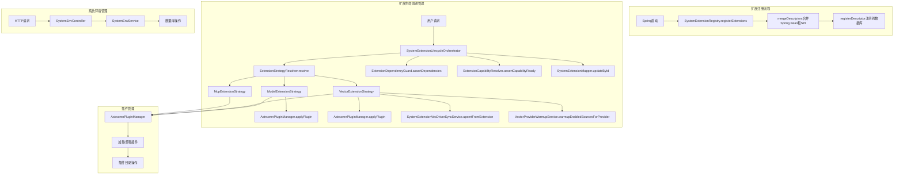

# 扩展系统架构分析

## 1. 架构概览

Astrsomn 系统的扩展架构主要由以下几个核心模块组成：

- **扩展生命周期管理**：负责扩展的应用、撤销和卸载操作
- **插件管理**：负责插件的注册、加载和卸载
- **系统环境管理**：提供系统环境的CRUD操作接口

## 2. 目录结构

### 2.1 扩展服务目录 (`extension`)

```
extension/
├── capability/            # 扩展能力解析
│   └── ExtensionCapabilityResolver.java
├── dependency/            # 扩展依赖管理
│   ├── ExtensionDependencyGuard.java
│   ├── ExtensionDependencyParseResult.java
│   ├── ExtensionDependencyParser.java
│   └── ExtensionDependencySpec.java
├── guard/                 # 扩展保护检查
│   ├── SystemExtensionModelGuard.java
│   └── SystemExtensionVecGuard.java
├── lifecycle/             # 扩展生命周期管理
│   ├── ExtensionLifecycleStrategy.java
│   ├── ExtensionStrategyResolver.java
│   ├── McpExtensionStrategy.java
│   ├── ModelExtensionStrategy.java
│   ├── SystemExtensionLifecycleOrchestrator.java
│   └── VectorExtensionStrategy.java
└── warmup/                # 扩展预热服务
    └── VectorProviderWarmupService.java
```

### 2.2 插件目录 (`plugin`)

```
plugin/
├── metadata/              # 插件元数据读取
│   └── ExtensionJarMetadataReader.java
└── registry/              # 插件注册
    └── SystemExtensionRegistry.java
```

### 2.3 系统环境控制器

```
api/SystemEnvController.java
```

## 3. 核心组件分析

### 3.1 扩展生命周期管理

#### SystemExtensionLifecycleOrchestrator

**作用**：扩展生命周期的核心协调器，负责协调扩展的应用、撤销和卸载操作。

**主要功能**：
- `apply(Long id)`：应用扩展，包括依赖检查、策略执行、能力检查和状态更新
- `revoke(Long id)`：撤销扩展，包括状态检查、策略执行和状态更新
- `uninstall(Long id)`：卸载扩展，包括策略执行、数据库删除和文件清理

**关键依赖**：
- `SystemExtensionMapper`：数据库操作
- `ExtensionStrategyResolver`：策略解析
- `ExtensionDependencyGuard`：依赖检查
- `ExtensionCapabilityResolver`：能力检查
- `AstrsomnPluginManager`：插件管理

#### ExtensionStrategyResolver

**作用**：根据扩展类型解析对应的生命周期策略。

**主要功能**：
- `resolve(String typeCode)`：根据扩展类型代码解析对应的生命周期策略

**关键依赖**：
- `ExtensionLifecycleStrategy`：生命周期策略接口

#### 扩展策略实现

**ModelExtensionStrategy**：
- **支持类型**：模型提供者扩展
- **主要功能**：管理模型提供者扩展的应用、撤销和卸载
- **关键依赖**：`AstrsomnPluginManager`、`SystemExtensionModelGuard`

**VectorExtensionStrategy**：
- **支持类型**：向量存储扩展
- **主要功能**：管理向量存储扩展的应用、撤销和卸载，包括向量驱动同步和预热
- **关键依赖**：`AstrsomnPluginManager`、`SystemExtensionVecDriverSyncService`、`SystemExtensionVecGuard`、`VectorProviderWarmupService`

**McpExtensionStrategy**：
- **支持类型**：MCP扩展
- **主要功能**：管理MCP扩展的应用、撤销和卸载

### 3.2 插件管理

#### SystemExtensionRegistry

**作用**：系统扩展注册表，负责从Spring Bean和SPI中加载扩展描述符并注册到数据库。

**主要功能**：
- `mergeDescriptors(ApplicationContext)`：合并Spring Bean和SPI中的扩展描述符
- `registerExtensions()`：注册扩展到数据库
- `registerDescriptor(String, AstroExtensionDescriptor)`：注册单个扩展描述符

**关键依赖**：
- `ApplicationContext`：Spring应用上下文
- `SystemExtensionMapper`：数据库操作

#### ExtensionJarMetadataReader

**作用**：读取扩展jar包的元数据。

### 3.3 系统环境管理

#### SystemEnvController

**作用**：提供系统环境的CRUD操作接口。

**主要功能**：
- `create(SystemEnvCreateRequestDTO)`：创建系统环境
- `delete(String)`：删除系统环境
- `update(SystemEnvUpdateRequestDTO)`：更新系统环境
- `queryPage(BasePageRequest<SystemEnvQueryRequestDTO>)`：分页查询系统环境
- `detail(Long)`：获取系统环境详情

**关键依赖**：
- `SystemEnvService`：系统环境服务

## 4. 数据流转图



## 5. 核心流程说明

### 5.1 扩展注册流程

1. 系统启动时，`SystemExtensionRegistry` 的 `registerExtensions` 方法被调用
2. 该方法通过 `mergeDescriptors` 合并来自Spring Bean和SPI的扩展描述符
3. 对每个扩展描述符，调用 `registerDescriptor` 方法注册到数据库
4. 如果扩展已存在，则更新元数据；如果不存在，则插入新记录

### 5.2 扩展应用流程

1. 用户请求应用扩展，调用 `SystemExtensionLifecycleOrchestrator.apply` 方法
2. 该方法首先获取扩展信息，然后调用 `ExtensionDependencyGuard.assertDependencies` 检查依赖
3. 接着调用 `ExtensionStrategyResolver.resolve` 解析对应的生命周期策略
4. 调用策略的 `apply` 方法执行应用操作，如加载插件、同步向量驱动等
5. 调用 `ExtensionCapabilityResolver.assertCapabilityReady` 检查能力是否就绪
6. 更新扩展状态为已应用

### 5.3 扩展撤销流程

1. 用户请求撤销扩展，调用 `SystemExtensionLifecycleOrchestrator.revoke` 方法
2. 该方法首先检查扩展状态是否为已应用
3. 调用 `ExtensionStrategyResolver.resolve` 解析对应的生命周期策略
4. 调用策略的 `revoke` 方法执行撤销操作，如卸载插件、移除向量驱动等
5. 更新扩展状态为已安装

### 5.4 扩展卸载流程

1. 用户请求卸载扩展，调用 `SystemExtensionLifecycleOrchestrator.uninstall` 方法
2. 调用 `ExtensionStrategyResolver.resolve` 解析对应的生命周期策略
3. 调用策略的 `uninstall` 方法执行卸载操作，如卸载插件、移除向量驱动等
4. 从数据库中删除扩展记录
5. 尝试从磁盘删除插件jar文件

### 5.5 系统环境管理流程

1. 用户通过HTTP请求调用 `SystemEnvController` 的相应方法
2. `SystemEnvController` 调用 `SystemEnvService` 的相应方法
3. `SystemEnvService` 执行数据库操作，如创建、删除、更新、查询系统环境
4. 返回操作结果给用户

## 6. 技术特点

1. **模块化设计**：扩展系统采用模块化设计，将不同功能分离到不同的模块中，便于维护和扩展
2. **策略模式**：使用策略模式处理不同类型扩展的生命周期管理，提高代码的可扩展性
3. **依赖注入**：充分利用Spring的依赖注入功能，提高代码的可测试性和可维护性
4. **SPI机制**：支持通过SPI机制加载扩展，提高系统的扩展性
5. **安全性**：在扩展操作前进行依赖检查和能力检查，确保系统的稳定性和安全性
6. **事务管理**：在扩展操作中使用事务管理，确保操作的原子性

## 7. 总结

Astrsomn 系统的扩展架构设计合理，采用了模块化、策略模式等设计理念，实现了对不同类型扩展的统一管理。扩展系统支持通过Spring Bean和SPI机制加载扩展，提供了完整的生命周期管理功能，包括应用、撤销和卸载操作。同时，系统环境管理模块提供了对系统环境的CRUD操作接口，方便用户管理系统配置。

这种设计不仅提高了系统的可扩展性和可维护性，也为用户提供了更加灵活和强大的扩展能力，使得系统能够更好地适应不同的业务需求。