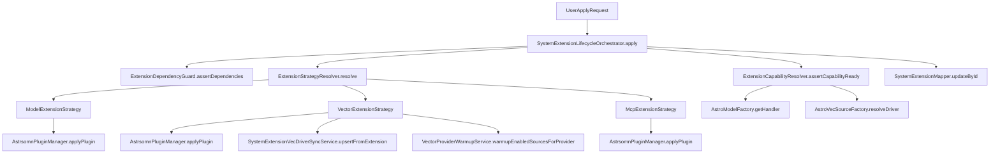
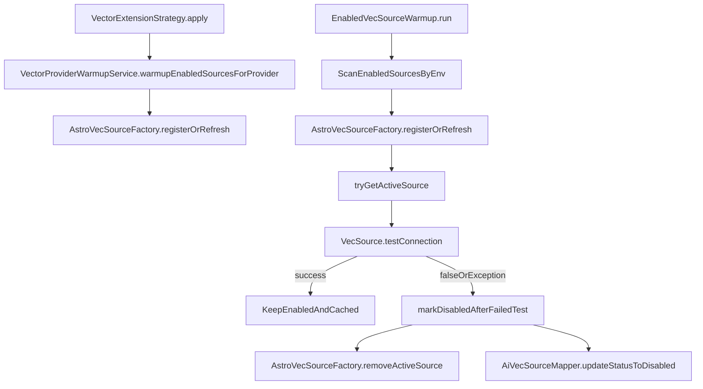

# Astrsomn 扩展依赖体系速读（Maven/JAR + Model/Vector）

## 1. 你现在最需要先记住的结论

- Astrsomn 扩展存在两条“发现与加载”路径：`Maven(classpath)` 和 `插件JAR(plugins目录)`。
- 扩展类型分三类，但你当前关心的是两类：`MODEL_PROVIDER` 与 `VECTOR_STORE`。
- `vector` 比 `model` 多一层“运行时连接句柄管理”：需要把数据库里的 `AiVecSourceEntity` 绑定成 `VecSource` 并缓存。
- `vector` 有两次预热：
  - 插件应用后，按 provider 增量预热（只预热当前插件厂商的 enabled 源）。
  - 进程启动后，按 env 全量扫描 enabled 源做预热。
- 预热失败不是静默：会移除缓存并把数据库状态更新为 `DISABLED`（防止脏连接长期占用）。

## 2. 术语统一（避免概念混乱）

- `extensionKey`：扩展唯一键，向量场景通常与 `provider` 一致。
- `providerCode`：模型场景优先使用，缺失时会回退到 `extensionKey`。
- `applied`：是否“已应用”扩展（`Y/N`）。
- `status`（扩展记录）：`INSTALLED` / `APPLIED` 等安装状态。
- `status`（向量源记录）：`ENABLED` / `DISABLED` 等可用状态。
- `envCode`：环境隔离键，vector 预热按当前有效环境过滤。

## 3. 双引入机制：Maven vs 插件 JAR

## 3.1 Maven（classpath）路径

- 启动后通过 `ServiceLoader` 扫描 classpath 中的 SPI。
- 对 vector 来说，`AstroVecSourceFactory` 在构造时就加载 `VecDriver`（`loadClasspathDrivers`）。
- 对 extension 描述来说，`SystemExtensionRegistry.mergeDescriptors` 先读 Spring Bean，再用 SPI 补充。

**典型特征**
- 不依赖 `plugins` 目录。
- 版本随应用发布，稳定但热插拔弱。

## 3.2 插件 JAR（plugins）路径

- `AstrsomnPluginManager` 从 `./plugins` 下加载 jar。
- 插件内 SPI 可提供：
  - `ModelProviderHandler`（模型）
  - `VecDriver`（向量）
- 向量驱动加载后会调用 `AstroVecSourceFactory.applyPluginDrivers`，同 `extensionKey` 会覆盖 classpath 实现。

**典型特征**
- 支持热应用、撤销、卸载。
- 需要额外处理依赖、能力检查、引用保护和磁盘 jar 生命周期。

## 4. 两类插件的核心差异（Model vs Vector）

| 维度 | Model 插件 | Vector 插件 |
|---|---|---|
| 生命周期策略 | `ModelExtensionStrategy` | `VectorExtensionStrategy` |
| 应用时动作 | `pluginManager.applyPlugin` | `applyPlugin` + `vecDriverSyncService.upsertFromExtension` + `vectorProviderWarmupService.warmupEnabledSourcesForProvider` |
| 撤销/卸载前校验 | 检查是否仍有模型或实例引用 | 检查 `AiVecSource` 是否仍引用 provider |
| 运行时资源 | 主要是 handler 注册 | 需要建立/刷新 `VecSource` 连接句柄缓存 |
| 失败风险点 | handler 不可发现 | 驱动可发现但连接不可用（预热失败禁用） |

## 5. 扩展生命周期总览（编排层）

核心编排入口是 `SystemExtensionLifecycleOrchestrator`：
- `apply(id)`：依赖检查 -> 策略执行 -> 能力检查 -> 更新为已应用。
- `revoke(id)`：已应用校验 -> 策略撤销 -> 更新为已安装。
- `uninstall(id)`：策略卸载 -> 删数据库记录 -> 尝试删除插件 jar 文件。

### 5.1 生命周期流程图

## 6. Vector 全链路：从扩展应用到连接预热

## 6.1 应用 Vector 扩展时（增量预热）

入口：`VectorExtensionStrategy.apply`

1. 若有 `jarName`，先 `pluginManager.applyPlugin(jarName)` 装载 SPI。
2. 同步驱动记录（`vecDriverSyncService.upsertFromExtension`）。
3. 调 `VectorProviderWarmupService.warmupEnabledSourcesForProvider(extensionKey)`：
   - 只筛当前 provider。
   - 只筛 `enabled`。
   - 只筛当前 `envCode`。
   - 对每条 `AiVecSourceEntity` 执行 `astroVecSourceFactory.registerOrRefresh(source)`。

## 6.2 进程启动后（全局预热）

入口：`EnabledVecSourceWarmup`（`ApplicationRunner`）

1. 获取当前有效 `envCode`。
2. 查询当前环境所有启用向量源。
3. 逐条处理：
   - `registerOrRefresh(source)`（建或刷新运行时句柄）
   - `tryGetActiveSource(sourceId)` 拿缓存句柄
   - `vecSource.testConnection()` 验证连通性
4. 记录成功/跳过/禁用统计日志。

## 6.3 连接句柄工厂与缓存（AstroVecSourceFactory）

`AstroVecSourceFactory` 的关键点：

- `resolveDriver(provider)`：优先插件覆盖驱动，再回退 classpath 驱动。
- `registerOrRefresh(entity)`：
  - 非 enabled：移除并关闭句柄。
  - enabled：比较配置指纹（host/port/账号/token/configJson 等），未变化则复用，变化则关闭旧句柄重建。
- `activeSources`：`sourceId -> VecSource`（运行时连接句柄缓存）。
- `removeActiveSource(sourceId)`：缓存清理 + `shutdown()` 释放。

## 6.4 Vector 预热/降级流程图

## 7. 关键类职责速查（按你指定范围）

## 7.1 `astrsomn-server/config`

- `EnabledVecSourceWarmup`
  - 输入：当前 `envCode` + 数据库中已启用 `AiVecSourceEntity`。
  - 输出：运行时 `VecSource` 缓存、连接测试结果、必要时数据库状态降级为 `DISABLED`。
  - 调用关系：依赖 `AstroVecSourceFactory` 完成注册/获取/移除，依赖 `AiVecSourceMapper` 回写状态。

## 7.2 `astrsomn-server/plugin`

- `SystemExtensionRegistry`
  - 输入：Spring 容器中的 `AstroExtensionDescriptor` + classpath SPI 的 `AstroExtensionDescriptor`。
  - 输出：`system_extension` 表的新增/更新记录。
  - 调用关系：`mergeDescriptors` 做“Spring优先、SPI补充”。

- `ExtensionJarMetadataReader`
  - 输入：待解析 jar 文件。
  - 输出：`SystemExtensionMetaData`（extensionKey/name/type/providerCode 等）。
  - 调用关系：通过独立 `URLClassLoader` + SPI 读取，读取完关闭加载器。

## 7.3 `astrsomn-server/service/extension`

- `SystemExtensionLifecycleOrchestrator`
  - 输入：扩展 ID。
  - 输出：扩展状态迁移（安装/应用/卸载）与操作结果。
  - 调用关系：串联依赖检查、策略执行、能力检查、数据库更新。

- `ExtensionStrategyResolver` + `ExtensionLifecycleStrategy`
  - 输入：扩展类型码。
  - 输出：对应生命周期策略实现。
  - 调用关系：把 `MODEL_PROVIDER` / `VECTOR_STORE` / `MCP` 分发到不同策略。

- `ModelExtensionStrategy`
  - 输入：模型扩展实体。
  - 输出：插件加载/卸载。
  - 调用关系：撤销/卸载前调用 `SystemExtensionModelGuard` 做引用保护。

- `VectorExtensionStrategy`
  - 输入：向量扩展实体。
  - 输出：插件加载/卸载、驱动同步、增量预热。
  - 调用关系：调用 `VectorProviderWarmupService` 触发 provider 级预热。

- `McpExtensionStrategy`
  - 输入：MCP 扩展实体。
  - 输出：插件加载/卸载。

- `VectorProviderWarmupService`
  - 输入：providerCode。
  - 输出：当前环境下该 provider 的 enabled 向量源被 registerOrRefresh。
  - 调用关系：面向“扩展刚应用”的增量场景，不做失败即禁用的强降级。

- `ExtensionDependencyParser` / `ExtensionDependencyGuard`
  - 输入：扩展 description 中的 `deps:hard=...;soft=...`。
  - 输出：硬依赖阻断（抛错）或软依赖告警（记录 warning）。
  - 调用关系：在 `apply` 前执行，防止半残状态上线。

- `ExtensionCapabilityResolver`
  - 输入：扩展实体（providerCode/extensionKey）。
  - 输出：模型 handler 或向量 driver 是否可发现。
  - 调用关系：`apply` 后做能力确认，确保 SPI 真正可用。

- `SystemExtensionModelGuard` / `SystemExtensionVecGuard`
  - 输入：扩展 ID。
  - 输出：是否允许撤销/卸载。
  - 调用关系：防止在仍有模型实例或向量源引用时误卸载。

## 7.4 `astrsomn-spring-boot-starter/langchain/vector`

- `AstroVecSourceFactory`
  - 输入：`AiVecSourceEntity`、provider、插件驱动列表。
  - 输出：`VecSource` 运行时句柄与缓存状态。
  - 调用关系：
    - 启动阶段加载 classpath 驱动。
    - 插件阶段接收覆盖驱动（同 key 覆盖）。
    - 预热阶段根据 source 实体构建连接并缓存。

## 8. 为什么会出现“我看不过来”的典型链路（一步到位记忆法）

- “发现扩展”看 `SystemExtensionRegistry`（Spring/SPI 合并）。
- “应用扩展”看 `SystemExtensionLifecycleOrchestrator`（统一编排）。
- “vector为什么要多一步”看 `VectorExtensionStrategy` + `AstroVecSourceFactory`（驱动 + 连接句柄）。
- “重启后状态变化”看 `EnabledVecSourceWarmup`（全量预热 + 失败降级）。

## 9. 常见问题定位（现象 -> 先看哪里）

- 现象：**扩展显示已应用，但能力不可用**
  - 先看：`ExtensionCapabilityResolver` 是否发现 handler/driver。
  - 再看：`AstrsomnPluginManager` 日志里是否真正加载到 SPI 实现。

- 现象：**vector 插件应用成功，但业务查询仍连不上**
  - 先看：`VectorProviderWarmupService` 是否筛到了当前 env + enabled 的源。
  - 再看：`AstroVecSourceFactory.registerOrRefresh` 是否因状态或指纹逻辑未重建。

- 现象：**重启后部分向量源被自动变成 DISABLED**
  - 先看：`EnabledVecSourceWarmup.testVecSourceConnection` 是否 false/异常。
  - 这是预期保护行为：失败后会 `removeActiveSource` + DB 标记 `DISABLED`。

- 现象：**撤销/卸载扩展被拒绝**
  - model 看 `SystemExtensionModelGuard`（模型记录与实例引用）。
  - vector 看 `SystemExtensionVecGuard`（是否还有 `AiVecSource` 引用 provider）。

- 现象：**同一个 provider 走的不是你新装的插件实现**
  - 先看：`AstroVecSourceFactory.resolveDriver`，确认 key 是否一致。
  - 再看：插件 jar 卸载/重载后是否正确触发 `applyPluginDrivers/removePluginDrivers`。

## 10. 新增一个 provider 的最小接入清单

1. 提供 SPI 实现（Maven 路径或插件 JAR 路径）：
   - model：`ModelProviderHandler`
   - vector：`VecDriver`
2. 保证 `extensionKey/providerCode` 命名与数据库 `provider` 对齐。
3. 若走插件 JAR，确保可被 `AstrsomnPluginManager` 发现并加载。
4. 应用扩展后验证：
   - 编排层返回成功。
   - 能力检查通过（可解析到 handler/driver）。
   - vector 场景下预热日志与缓存状态正常。
5. 重启后再验证一次 `EnabledVecSourceWarmup` 行为，确认不会被错误降级。