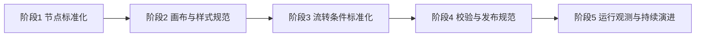

# AI Workflow 标准化逐步建设方案

## 1. 背景与目标

当前已经完成了工作流搭建页基础骨架（左侧节点库、中间画布、右侧属性面板），下一步需要把“能搭”升级为“可复用、可治理、可持续扩展”的标准化流程平台。

本方案目标：

- 建立统一的节点规范与元模型，避免后续节点扩展失控
- 建立一致的流程样式规范，保障可读性与可维护性
- 建立标准化流转条件机制，支持复杂分支和后续策略迭代
- 建立版本、校验、发布、观测能力，为后续大规模流程接入打基础

---

## 2. 建设原则

- **标准优先**：先定义规范，再扩展能力
- **配置驱动**：节点字段与校验规则尽量 schema 化
- **兼容演进**：`graphJson` 保持向前兼容，支持渐进升级
- **分层治理**：编辑态、校验态、发布态分层处理
- **可观测性内建**：从设计阶段就考虑执行追踪和问题定位

---

## 3. 总体分阶段路线



---

## 4. 阶段 1：节点定义标准化（优先级 P0）

### 4.1 目标

把当前 `start/llm/tool/condition/end` 从“硬编码节点”升级为“节点注册中心 + schema 配置”模式。

### 4.2 输出物

- 节点规范文档（节点类型、输入输出、默认配置、可见属性）
- 节点注册表（Node Registry）
- 节点参数 schema（字段类型、必填、默认值、校验）
- 节点 UI 映射（图标、颜色、尺寸、handle 规则）

### 4.3 推荐数据结构

```ts
type NodeDefinition = {
  type: string
  category: 'base' | 'execute' | 'logic' | 'integration'
  title: string
  description: string
  io: {
    inputs: Array<{ key: string; type: string; required?: boolean }>
    outputs: Array<{ key: string; type: string }>
  }
  configSchema: Array<{
    key: string
    label: string
    component: 'input' | 'textarea' | 'select' | 'number' | 'switch'
    required?: boolean
    defaultValue?: unknown
    options?: Array<{ label: string; value: string }>
  }>
}
```

### 4.4 实施步骤

1. 建立 `nodeRegistry`（集中维护节点元数据）
2. 右侧属性面板从 `if/else` 改为根据 schema 渲染动态表单
3. 新增节点时只新增定义，不改主流程逻辑
4. 为每个节点增加 `version` 字段，支持未来参数升级

### 4.5 验收标准

- 新增一个节点类型无需改画布核心逻辑
- 右侧面板字段 80% 以上由 schema 驱动
- `graphJson` 中节点 `config` 结构稳定且可回填

---

## 5. 阶段 2：流程样式标准化（优先级 P0）

### 5.1 目标

统一画布视觉语言，让不同人构建的流程在结构和观感上保持一致。

### 5.2 输出物

- 流程 UI 设计规范（颜色、字体、节点尺寸、间距、连线样式）
- 节点类别视觉规范（基础/执行/逻辑/集成）
- 布局建议规范（主链自左向右，分支上下展开）
- 可访问性约束（对比度、字号、状态提示）

### 5.3 推荐规范项

- 节点宽高基线：`min-width`、`padding`、标题和副标题字号统一
- 连线标准：默认 `smoothstep + arrow`，条件线区分标签
- 状态标准：`draft/published/error` 颜色与标识统一
- 交互标准：选中态、hover 态、拖拽态统一视觉反馈
- 画布工具区：缩放、适配、网格开关、迷你地图（后续）

### 5.4 验收标准

- 同类节点视觉风格一致
- 复杂流程（20+ 节点）可读性可接受
- 新增节点不需要单独重新定义大量样式

---

## 6. 阶段 3：流转条件标准化（优先级 P0）

### 6.1 目标

把条件分支从“文本描述”升级为“结构化表达式 + 校验规则 + 可预览”。

### 6.2 输出物

- 条件表达式 DSL（或 JSON 结构）规范
- 条件分支连线规则（true/false/default）
- 条件编辑器（先简版：字段 + 操作符 + 值）
- 条件校验器（语法校验 + 引用变量校验）

### 6.3 推荐条件结构

```json
{
  "operator": "and",
  "rules": [
    { "left": "context.intent", "op": "eq", "right": "refund" },
    { "left": "context.confidence", "op": "gte", "right": 0.8 }
  ]
}
```

### 6.4 规则约束建议

- `condition` 节点至少 2 条输出（true/false）
- 允许 `default` 分支兜底，避免流程断裂
- 表达式只允许白名单操作符（`eq/ne/gt/gte/lt/lte/in/contains`）
- 变量引用必须来自上游节点输出或全局上下文

### 6.5 验收标准

- 条件表达式可序列化、可回填、可校验
- 条件节点流转在编辑态可视化清晰
- 非法条件可在发布前被阻断

---

## 7. 阶段 4：校验、发布与版本治理（优先级 P1）

### 7.1 目标

确保流程“可编辑”同时“可发布、可回滚、可追责”。

### 7.2 输出物

- 编辑态校验（实时轻校验）
- 发布前校验（强校验）
- 版本策略（草稿版、发布版、历史版）
- 变更说明与发布备注机制

### 7.3 发布前强校验清单

- 必须存在且仅存在 1 个 `start`
- 至少存在 1 个 `end`
- 所有节点可达、无孤岛
- 条件节点分支完整
- 必填参数完整
- 禁止循环（首期可先禁）

### 7.4 验收标准

- 不合法流程无法发布
- 发布版本可追溯到具体 `graphJson`
- 支持从历史版本恢复草稿

---

## 8. 阶段 5：运行观测与持续演进（优先级 P1）

### 8.1 目标

让流程在上线后可监控、可定位、可优化。

### 8.2 输出物

- 节点级执行日志（输入、输出、耗时、错误）
- 流程级指标（成功率、平均耗时、超时率）
- 调试视图（按执行路径回放）
- 失败重试与降级策略（后续）

### 8.3 验收标准

- 任一失败实例可以定位到具体节点和条件路径
- 可对高失败节点进行统计与优化

---

## 9. 里程碑建议（4~6 周）

- **M1（第 1-2 周）**：完成节点注册中心 + schema 驱动表单 + 样式规范基线
- **M2（第 3-4 周）**：完成条件 DSL + 条件节点校验 + 发布前强校验
- **M3（第 5-6 周）**：完成版本治理与执行观测首版

---

## 10. 当前代码落地建议（与现状对齐）

建议在现有 `definition/builder` 结构基础上继续演进：

- `constants.ts`：升级为节点注册中心入口
- `types.ts`：补齐 `NodeDefinition`、`ConditionExpression`、`ValidationError`
- `NodeInspector.vue`：由硬编码字段改为 schema 渲染器
- `useWorkflowGraph.ts`：加入 `validateGraph()` 与 `normalizeGraph()` 能力
- 新增 `validators/`：图结构校验、条件表达式校验、发布校验

---

## 11. 风险与应对

- **风险：节点快速增加导致配置混乱**  
  应对：强制走 registry + schema，禁止散落写字段

- **风险：条件表达式复杂度失控**  
  应对：先做有限 DSL，逐步放开操作符

- **风险：不同流程风格不统一**  
  应对：样式 token 化，节点视觉规范固化

- **风险：后续运行引擎适配成本高**  
  应对：`graphJson` 先稳定语义模型，再映射执行层

---

## 12. 下一步执行清单（可直接开工）

1. 抽离 `nodeRegistry` 并迁移现有 5 类节点定义  
2. 把右侧面板改为 schema 驱动渲染  
3. 为 `condition` 节点接入结构化表达式模型  
4. 新增 `validateGraph()` 并在“发布按钮”前执行  
5. 补一套最小测试样例（合法流程/非法流程/边界流程）

该方案完成后，你的工作流平台会从“可编辑原型”升级为“可标准化扩展平台”，能稳定支撑后续更多业务流程接入。
