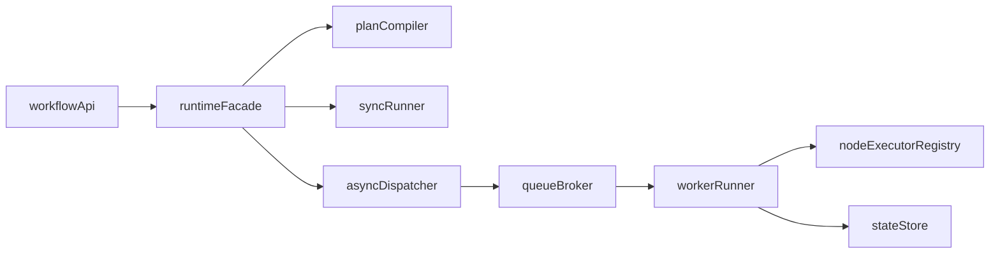

# Astrsomn Workflow 实例层：核心架构（混合执行）

## 1. 目标
- 同时满足：同步 `test-run`（调试体验）+ 异步生产执行（稳定可恢复）。

## 2. 总体架构

## 3. 同步 test-run 通路
1. 接收 `test-run` 请求。
2. 编译草稿或加载已发布计划。
3. 在单进程 `syncRunner` 执行。
4. 返回结果 + 节点执行轨迹摘要（可选）。

特点：
- 低延迟；
- 便于调试；
- 默认不落完整实例（可配置 debug 落库）。

## 4. 异步生产通路
1. `start-instance` 生成实例并入队。
2. `workerRunner` 拉取任务执行节点。
3. 每个节点完成后推进 token 并持久化状态。
4. 进入人工节点则挂起，等待 `resume`。
5. 实例完成/失败后写最终状态并发布事件。

## 5. 调度与并发
- 队列模型：`instance-partitioned queue`（按实例分区避免乱序）。
- worker 并发：可配置线程池 + 节点并行上限。
- 并行节点：派生多个 branch task，同步于 merge 节点。

## 6. 幂等与去重
- 实例启动幂等键：`workflowKey + businessKey + requestId`。
- 节点执行幂等键：`instanceId + nodeId + attemptNo`。
- 消息重复投递按幂等键忽略。

## 7. 恢复与重放
- Worker 重启后从 `RUNNING/WAITING_RETRY` 实例恢复。
- 节点级重放：仅重放失败节点及其下游可重算路径。
- 人工恢复：审批后以新事件推进实例继续执行。

## 8. 分阶段目标
- **V1 必做**：同步 test-run + 异步实例主链路 + 人工恢复。
- **V1.5 可选**：优先级队列、延时重试队列。
- **V2 增强**：多 Region 执行与跨集群容灾。
