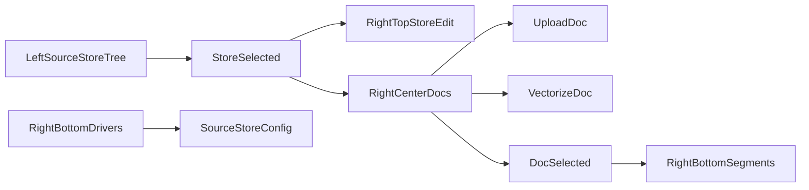

# 向量中心首批 CRUD 对接与双库演进方案

## 1. 目标

- 将 `vector-center` 从静态样例切换为真实后端数据驱动。
- 首批覆盖五类实体的最小 CRUD 闭环：`Driver`、`Source`、`Store`、`Doc`、`Segment`。
- 初期仅支持两种向量库类型：`qdrant`、`chroma`。

## 2. 对接范围与页面映射

### 2.1 页面路径

- `astrsomn-ui/src/views/admin/ai-vector/vector-center/Index.vue`
- `astrsomn-ui/src/views/admin/ai-vector/vector-center/component/Left.vue`
- `astrsomn-ui/src/views/admin/ai-vector/vector-center/component/RightTop.vue`
- `astrsomn-ui/src/views/admin/ai-vector/vector-center/component/RightCenter.vue`
- `astrsomn-ui/src/views/admin/ai-vector/vector-center/component/RightBottom.vue`
- `astrsomn-ui/src/views/admin/ai-vector/vector-center/hooks/useVectorCenterState.ts`

### 2.2 API 映射矩阵

| 页面动作 | 接口 | 说明 |
|---|---|---|
| 查询数据源 | `POST /v1/astro/ai-vec-source/queryPage` | 左树一级节点 |
| 新增/编辑/删除数据源 | `create/update/delete` | `Left.vue` 上下文菜单 |
| 查询数据库集合 | `POST /v1/astro/ai-vec-store/queryPage` | 左树二级节点 |
| 新增/编辑/删除集合 | `create/update/delete` | `Left.vue` 上下文菜单 |
| 修改集合信息 | `POST /v1/astro/ai-vec-store/update` | `RightTop.vue` 保存按钮 |
| 查询文档 | `POST /v1/astro/ai-vec-doc/queryPage` | `RightCenter.vue` 文档卡片 |
| 文档新增/编辑/删除 | `create/update/delete` | `RightCenter.vue` |
| 上传文档 | `POST /v1/astro/ai-vec-doc/upload` | `RightCenter.vue` 上传 |
| 触发向量化 | `POST /v1/astro/ai-vec-doc/vectorize` | 文档卡片动作 |
| 查询驱动 | `POST /v1/astro/ai-vec-driver/queryPage` | `RightBottom.vue` |
| 驱动 CRUD | `create/update/delete` | `RightBottom.vue` |
| 查询切片 | `POST /v1/astro/ai-vec-segment/queryPage` | `RightBottom.vue` |
| 删除切片 | `DELETE /v1/astro/ai-vec-segment/delete/{ids}` | `RightBottom.vue` |

## 3. 分阶段落地策略

### Phase 1（已落地）

- Source/Store/Doc 主链路真实化：
  - 左侧数据树加载 Source + Store。
  - 右侧顶部展示并可修改当前 Store。
  - 文档列表支持上传、向量化、增删改。
- 增加统一状态编排层 `useVectorCenterState`，负责分页简化拉取和跨组件刷新。

### Phase 2（已落地）

- Driver 管理入口收敛到底部面板，支持创建、编辑、删除。
- Segment 列表下钻到当前文档维度，支持删除切片。
- Index 层集中触发刷新，保证 Source -> Store -> Doc -> Segment 的联动链路完整。

### Phase 3（进行中，首版已生效）

- Source 和 Driver 两处创建入口都将 provider 约束为 `qdrant/chroma`。
- Source 保存前增加前端守卫，非两类 provider 阻止提交。
- 后续补充：
  - `testConnection` 通过后允许启用（`set-status`）的流程型校验。
  - provider 特有参数模板（统一写入 `configJson`）。

## 4. 数据流

## 5. 验收标准

- `vector-center` 不依赖本地 mock 数组。
- 五类实体均可至少完成查询和单条增删改中的关键动作。
- `qdrant/chroma` 以外 provider 被 UI 拒绝。
- 上传与向量化在页面可见并可触发列表刷新。
- 操作失败有明确提示，不静默失败。

## 6. 后续完善建议

- 增加分页控件与筛选条件（当前首版采用固定大页拉取）。
- 为 Driver/Segment 增加独立弹窗表单，与现有 `vec-*` 页面保持一致视觉。
- 加入 `testConnection -> setStatus` 的强约束流程。
- 在 Source 表单中根据 provider 动态生成 `configJson` 模板，并提供 JSON schema 校验。
